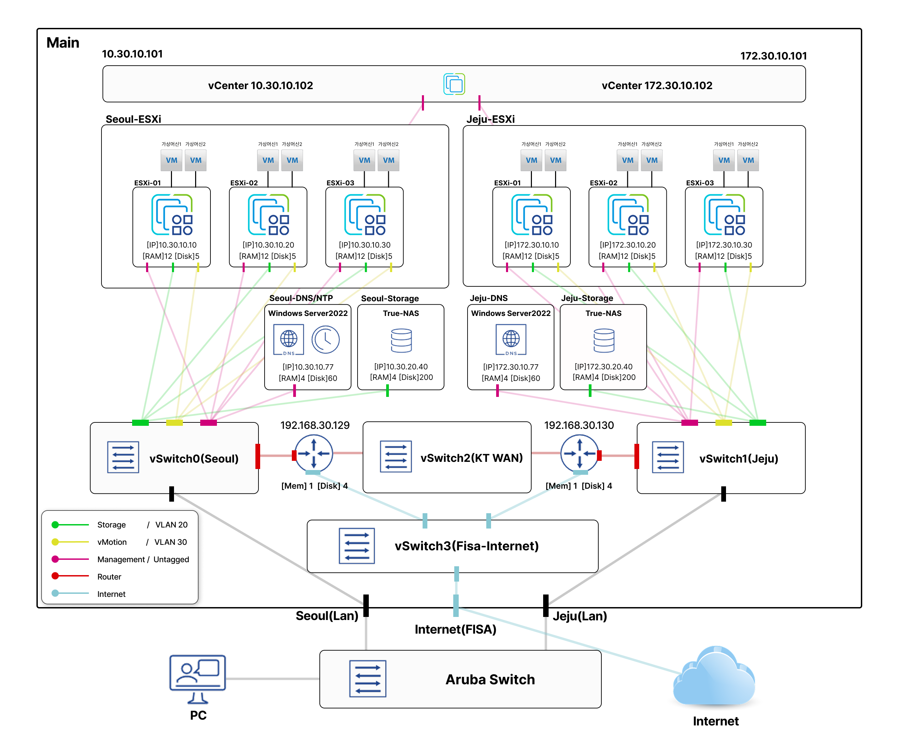
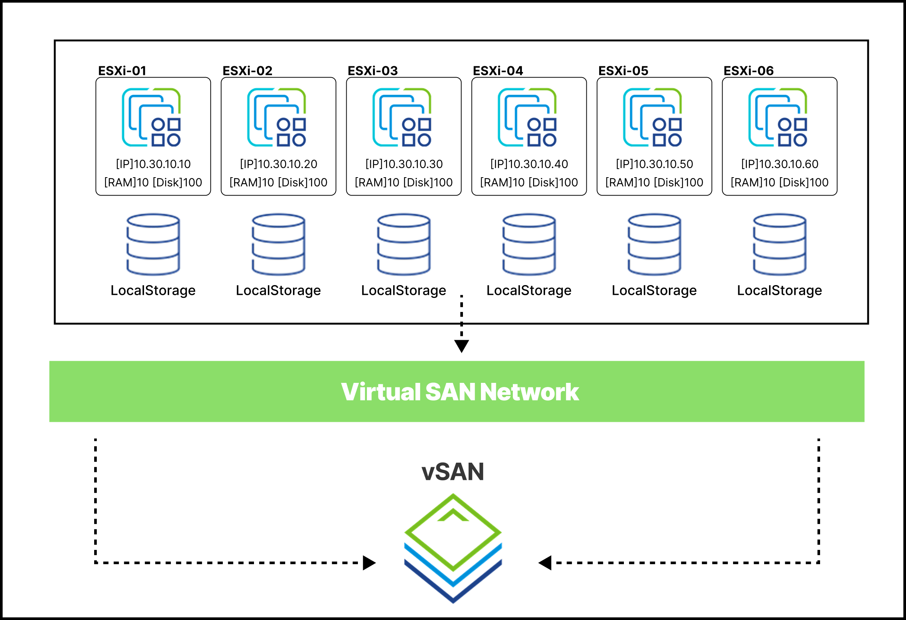

# 🏢 VMware 기반 듀얼사이트 데이터센터 구축

> 우리FISA 클라우드 엔지니어링 6기 VMware 팀 프로젝트

## 👩🏻‍💻 About Team Members

|  |  |  |  |  |  | 
|:--:|:--:|:--:|:--:|:--:|:--:|
| [**우승연**](https://github.com/wooxxo) | [**최승민**](https://github.com/Kumin-91) | [**서지혜**](https://github.com/seajihey) | [**이유진**](https://github.com/janie71) | [**권순재**](https://github.com/Soooonnn) | [**유동균**](https://github.com/dbehdrbs0806) | 

## 📖 Overview

물리 서버 1대 위에 **Nested Virtualization**으로 Seoul / Jeju **듀얼 사이트 데이터센터**를 구현한 프로젝트입니다.

단일 장애점(SPOF)을 제거하기 위해 **vCenter ELM(Enhanced Linked Mode)**, **VLAN 기반 트래픽 격리**, **vSAN 분산 스토리지**, **HA/DRS 클러스터링**을 적용하였으며, 최종적으로 **vCenter API 기반 VM 프로비저닝 웹 포털**까지 구현하였습니다.

## 💻 Architecture 

### Infra Architecture



### vSAN Architecture



## 🌐 Network Design

### ESXi 호스트 배치 및 네트워크 설정

두 개의 독립된 네트워크 대역을 VyOS 라우터로 연결하는 **멀티 사이트 구조**를 설계했습니다.

```
    ┌──────────────────────────────────────────────────────────────────┐
    │                       WAN Transit (KT-WAN)                       │
    │                192.168.30.129 ←──→ 192.168.30.130                │
    ├────────────────────────────────┬─────────────────────────────────┤
    │           Seoul Area           │            Jeju Area            │
    │          10.30.x.x/16          │          172.30.x.x/16          │
    ├────────────────────────────────┼─────────────────────────────────┤
    │  VLAN  0  │ Management         │  VLAN  0  │ Management          │
    │  VLAN 20  │ Storage (iSCSI)    │  VLAN 20  │ Storage (iSCSI)     │
    │  VLAN 30  │ vMotion            │  VLAN 30  │ vMotion             │
    │  VLAN 40  │ Fault Tolerance    │  VLAN 40  │ Fault Tolerance     │
    ├────────────────────────────────┼─────────────────────────────────┤
    │  ESXi-01    10.30.10.10        │  ESXi-01    172.30.10.10        │
    │  ESXi-02    10.30.10.20        │  ESXi-02    172.30.10.20        │
    │  ESXi-03    10.30.10.30        │  ESXi-03    172.30.10.30        │
    │  vCenter    10.30.10.102       │  vCenter    172.30.10.102       │
    │  TrueNAS    10.30.20.40        │  TrueNAS    172.30.20.40        │
    │  DNS        10.30.10.77        │  DNS        172.30.10.77        │
    └────────────────────────────────┴─────────────────────────────────┘
```

### Design Rationale

| 설계 원칙 | 적용 내용 |
|:---|:---|
| **트래픽 격리** | Management / Storage / vMotion / FT를 VLAN 0, 20, 30, 40으로 완전 분리 |
| **SSO 도메인 통합** | 양쪽 vCenter를 동일 SSO 도메인(`seoul.seung.fisa`)으로 ELM 구성 → 한쪽 장애 시에도 관리 가능 |
| **하이브리드 라우팅** | VyOS `eth0`에 Untagged(Mgmt) + Tagged(VLAN 20/30/40) 서브인터페이스 동시 운용 |
| **Trunk Port** | 라우터 연결 Port Group을 VLAN 4095로 설정하여 모든 태그 수용 |
| **공유 스토리지** | TrueNAS iSCSI를 전용 Storage VLAN(20)에 격리하여 공유 Datastore 구성 |

> vSwitch/Port Group 상세 설계, VyOS 라우터 설정, Nested ESXi 매핑 등은 [📄 Day 02](docs/Day02.md) 에서 확인할 수 있습니다.

## 🛠️ Infrastructure Features

| Feature | 설명 | 적용 목적 |
|:---|:---|:---|
| **Nested Virtualization** | 물리 서버 1대 위에 가상 ESXi 호스트를 중첩 구성 | 제한된 하드웨어에서 멀티 호스트 클러스터 환경 재현 |
| **Enhanced Linked Mode** | 두 vCenter를 동일 SSO 도메인으로 통합 관리 | 한쪽 vCenter 장애 시에도 동일 자격증명으로 VM 관리 가능 |
| **VLAN Segmentation** | Management / Storage / vMotion / FT 트래픽을 VLAN 0, 20, 30, 40으로 격리 | 트래픽 간섭 방지 및 보안성 확보 |
| **vSAN** | 여러 ESXi 호스트의 로컬 디스크를 하나의 분산 스토리지로 통합 (SDS) | Scale-Out 기반 확장, 정책 기반 스토리지 관리 |
| **DRS** | 클러스터 내 호스트 간 리소스 사용량을 모니터링하고 VM을 자동 재배치 | CPU/Memory 로드 밸런싱, Affinity/Anti-Affinity 규칙 적용 |
| **HA** | 호스트 장애 감지 시 해당 호스트의 VM을 다른 호스트에서 자동 재시작 | 단일 장애점 제거, 서비스 연속성 보장 |
| **FT** | Primary VM과 동일한 Secondary VM을 실시간 동기화하여 무중단 보호 | 미션 크리티컬 VM의 다운타임 제로 |
| **vMotion** | 실행 중인 VM을 다른 호스트로 무중단 라이브 마이그레이션 | DRS/HA의 기반 기술, 호스트 유지보수 시 서비스 중단 없이 이동 |
| **Content Library** | VM 템플릿, ISO 이미지를 중앙 저장소에서 관리 및 사이트 간 배포 | 멀티 사이트 간 템플릿 동기화, 표준화된 VM 배포 |
| **iSCSI Shared Storage** | TrueNAS 기반 ZFS Pool을 iSCSI Target으로 공유 | vMotion/HA를 위한 공유 Datastore 환경 구성 |

<br/>

## 📅 Daily Progress

> 각 Day별 상세 구축 과정과 설정 가이드는 아래 링크를 통해 확인할 수 있습니다.

| Day | Title | Key-Points | Docs |
|:--:|:--|:--|:--:|
| 1 | Strategic Planning & Conceptual Design | TBD | [📄 바로가기](./docs/Day_01.md) |
| 2 | Building Core Infrastructure & Management Plane | TBD | [📄 바로가기](./docs/Day_02.md) |
| 3 | Detailing Our Infrastructure - I | TBD | [📄 바로가기](./docs/Day_03.md) |
| 4 | Detailing Our Infrastructure - II | TBD | [📄 바로가기](./docs/Day_04.md) |
| 5 | vSAN and VM Provisioning Portal | TBD | [📄 바로가기](./docs/Day_05.md) |

## ⚠️ Troubleshooting

프로젝트 진행 중 겪은 주요 이슈와 해결 과정을 정리했습니다.

**Nested ESXi VLAN 이중 태깅 이슈**

- **문제**: Nested ESXi 내부 Port Group에 VLAN을 설정하자 통신 불가  

- **원인**: WS-ESXi Port Group에서 이미 태깅된 패킷에 Nested ESXi가 추가 태깅 → 이중 태깅 발생
- **해결**: Nested ESXi 내부 모든 Port Group의 VLAN을 0으로 설정 (L2 태깅 단일화 원칙 적용)

**Windows VM 템플릿 복제 시 SID/IP 충돌**

- **문제**: 템플릿에서 복제한 Windows VM들이 동일 SID와 IP를 가져 네트워크 충돌 발생  

- **원인**: Sysprep 미실행 상태로 템플릿 변환 → 원본의 고유 식별 정보(SID, IP)가 그대로 복제
- **해결**: 템플릿 생성 전 `sysprep /oobe /generalize /shutdown` 실행으로 식별 정보 초기화 + vCenter 사용자 지정 규격으로 배포 시 새 설정 자동 주입

> 각 이슈의 상세 분석은 Day별 문서에서 확인할 수 있습니다. → [Day 02](docs/Day02.md) | [Day 03](/Troubles/Day_03_Windows_10_Sysprep.md)


## 👩🏻‍💻 LAB - VMware VM Provisioning Portal


Spring Boot 기반으로 만든 VMware 가상머신 배포 자동화 웹 포털입니다.

* vCenter에 직접 접속해 템플릿, CPU, 메모리, 네트워크 등을 수동으로 선택하는 대신, 웹 화면에서 배포 정보를 입력하면 vCenter API를 통해 실제 VM을 생성하고, 이후 Guacamole을 이용한 원격 접속 URL까지 생성할 수 있도록 구현했습니다.

* 현재 배포 환경이 아니기에 Rocky Linux VM 배포를 기준으로 구성했습니다.

* ✨ 해당내용은 [VMwareWeb](https://github.com/seajihey/VMwareWeb)을 참고하세요

## 📂 Project Structure
```
VMware-TeamLab/
├── README.md              # 프로젝트 메인 (현재 문서)
├── docs/
│   ├── Day01.md           # Day 01 - 설계 및 초기 구성
│   ├── Day02.md           # Day 02 - 핵심 인프라 구축
│   ├── Day03.md           # Day 03 - 인프라 상세 설정 I
│   ├── Day04.md           # Day 04 - 인프라 상세 설정 II
│   └── Day05.md           # Day 05 - vSAN 및 웹 포털
├── Images/                # 아키텍처 다이어그램 및 스크린샷
├── Troubles/              # 트러블슈팅 기록
└── .gitignore
```

## 📚 Tech Stacks

| Category | Technologies |
|:---|:---|
| **Hypervisor** | VMware ESXi 7.0 |
| **Management** | vCenter Server 7.0.3 |
| **Network** | VyOS Router, VLAN (802.1Q), Static Routing, NAT |
| **Storage** | TrueNAS (iSCSI, ZFS), vSAN |
| **DNS** | Windows Server 2022 |
| **Application** | Spring Boot, Apache Guacamole |
| **OS** | Ubuntu, Rocky Linux |