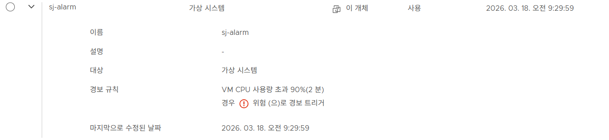
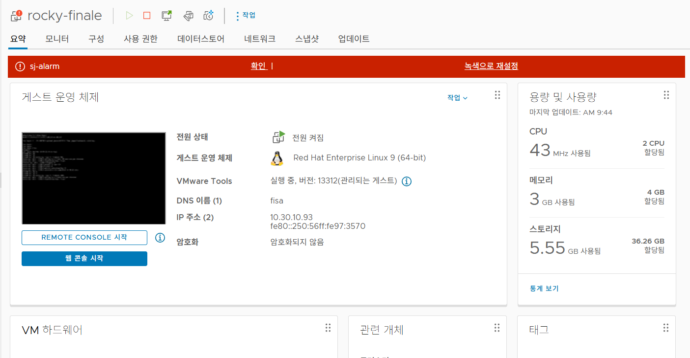
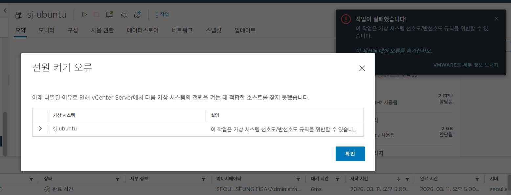
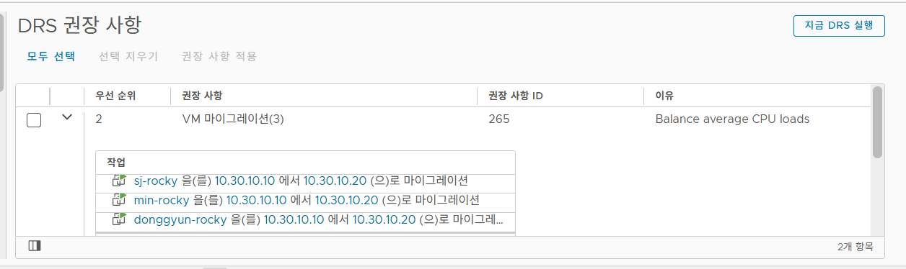
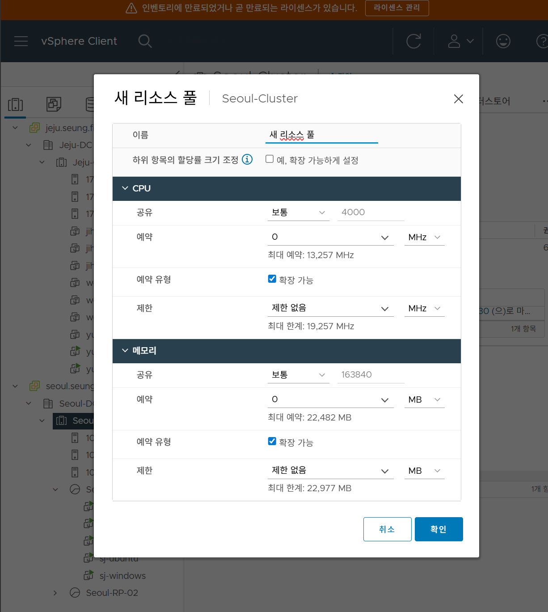
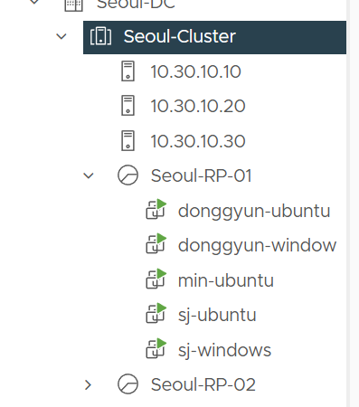
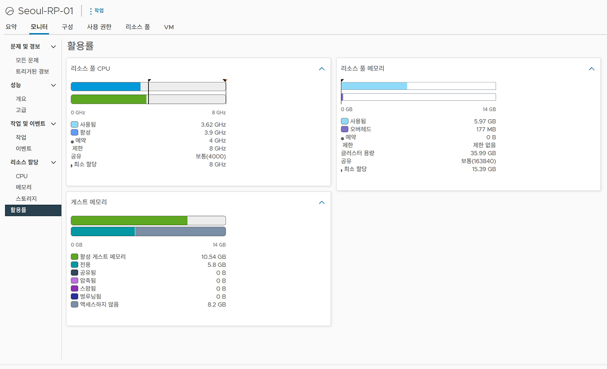
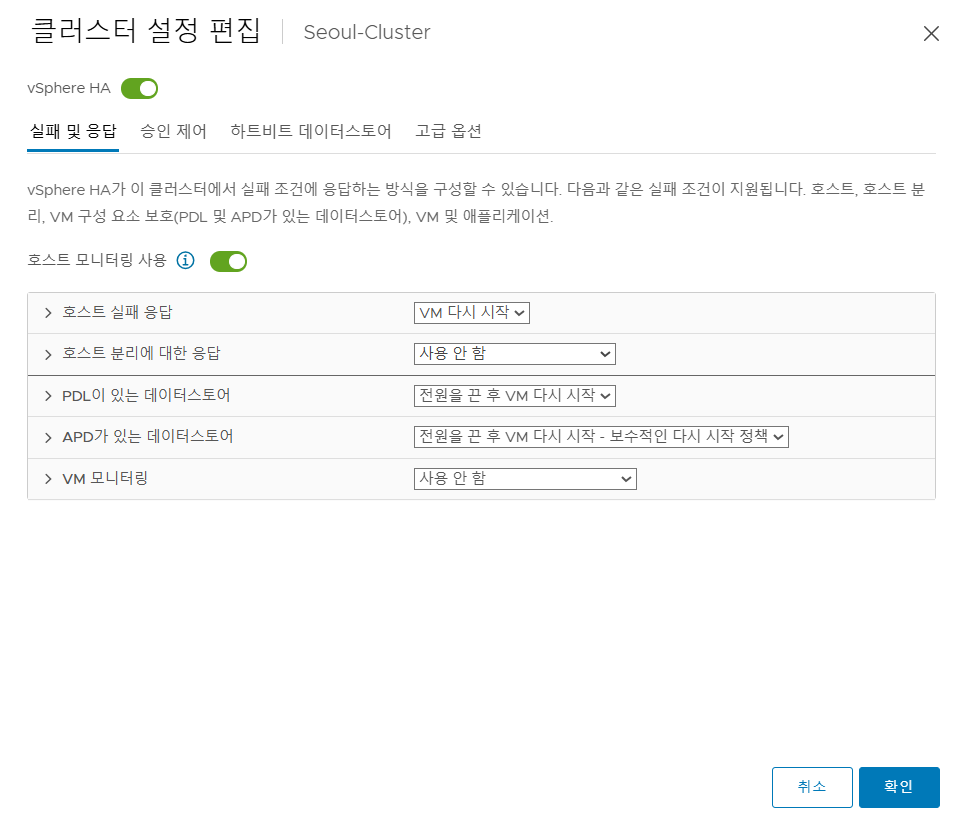
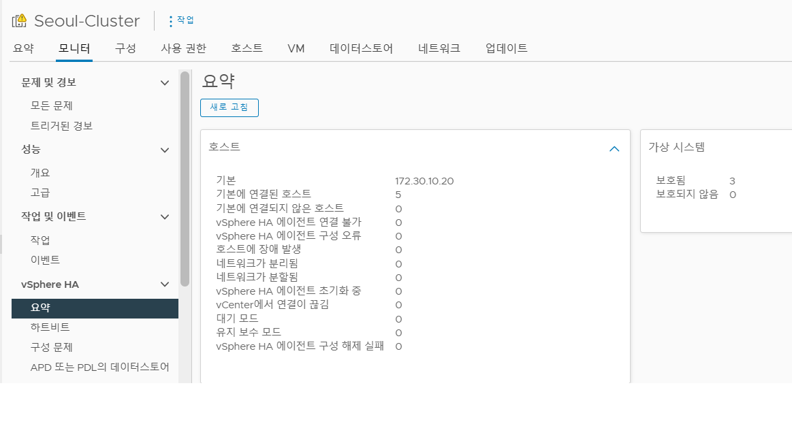

# VMware-TeamLab

## 💻 Architecture 

### Infra Architecture


### vSAN Architecture


## 📘 Index

[👩🏻‍💻 About Team Members](#-about-team-members)

[🤝 Day 01 - Strategic Planning & Conceptual Design](#-day-01---strategic-planning--conceptual-design)

[🌐 Day 02 - Building Core Infrastructure & Management Plane](#-day-02---building-core-infrastructure--management-plane)

[🧑🏻‍💻 Day 03 - Detailing Our Infrastructure - I](#-day-03---detailing-our-infrastructure---i)

[👩🏻‍💻 Day 04 - Detailing Our Infrastructure - II](#-day-04---detailing-our-infrastructure---ii)

[👩🏻‍💻 Day 05 - Finale (All for vSAN)](#-day-05---finale-all-for-vsan)

## 👩🏻‍💻 About Team Members

|  | |  |  |  |  | 
|:--:|:--:|:--:|:--:|:--:|:--:|
| [**우승연**](https://github.com/wooxxo) | [**최승민**](https://github.com/Kumin-91) | [**서지혜**](https://github.com/seajihey) | [**이유진**](https://github.com/janie71) | [**권순재**](https://github.com/Soooonnn) | [**유동균**](https://github.com/dbehdrbs0806) | 

## 🤝 Day 01 - Strategic Planning & Conceptual Design

> **2026.03.06 금요일**

### 1. 목표
단일 장애점을 제거한 **고가용성 이중화 데이터센터** 구축을 최종 목표로,
Day 01에서는 전체 아키텍처 설계 및 ESXi 초기 환경 구성을 진행했습니다.

> ESXi 클러스터 → vCenter 이중화 → VLAN 분리 → vSAN 기반 분산 스토리지로 이어지는 전체 구조를 설계했습니다.

### 2. 왜 클러스터 + 이중 vCenter 구조로 설계하였는가?
두 개의 네트워크 대역 (`172.30.x.x/16`, `10.30.x.x/16`) 으로 분리하고,
각 대역 간 VyOS 라우터로 통신하는 구조를 채택했습니다.

- 단일 vCenter 장애 시 전체 관리 불가 문제를 방지하기 위해 SSO 도메인을 통일,
  한쪽 vCenter가 다운되어도 나머지 vCenter에서 동일한 자격증명으로 VM 관리가 가능하도록 설계했습니다.

### 3. ESXi 설치

물리 서버 1대에 USB 부팅으로 ESXi를 설치하고, Management Network IP를 수동으로 할당했습니다.

#### ⚠️ Troubleshooting
- **🔴 문제** : ESXi 설치(USB)를 위한 BIOS 진입 불가  

- **🔍 원인** : 레거시 BIOS 방식 사용  

- **✅ 해결** : `Enter` 키로 BIOS 진입 성공

> 장비마다 BIOS 진입 방식이 다를 수 있습니다.

## 🌐 Day 02 - Building Core Infrastructure & Management Plane

> **2026.03.10 화요일**

### 0. Day 02 구축 목표 및 핵심 전략

Day 02의 핵심은 실제 기업 환경과 동일한 논리적 격리 및 통합 관리 체계의 완성입니다. 오늘 구축하는 인프라는 이후 진행될 모든 가상화 실습의 견고한 기반이 됩니다.

* 멀티 사이트 논리 격리: Seoul과 Jeju라는 두 개의 독립된 Area를 가정하고, 각 지역의 Management Network을 완전히 분리하여 보안성과 실무 적합성을 확보합니다.

* L3 게이트웨이 및 연결성 확보: VyOS 라우터를 선제적으로 구축하여 개인 Laptop, ESXi 호스트 간의 원활한 통신을 구현하고, NAT 설정을 통해 모든 내부 자원의 외부 Internet 접근 경로를 확보합니다.

* FQDN 기반 관리 체계 수립: 지역별 독립 DNS Server를 구축하고 VCSA (vCenter) 레코드를 사전 등록하여, IP가 아닌 도메인 이름 기반의 전문적인 인프라 관리 환경을 조성합니다.

* Nested 가상화 최적화: WS-ESXi의 Port Group을 정밀하게 설계하여 지역별 vSwitch를 물리적으로 분리된 것처럼 모사하고, 각 지역의 호스트가 지정된 전용 통로로만 통신하도록 강제합니다.

* 고가용성 공유 스토리지 구현: TrueNAS 기반의 iSCSI Storage Network를 구축하여, 향후 vMotion 및 HA 실습의 핵심 자원인 공유 Datastore 환경을 완성합니다.

### 1. WS-ESXi 호스트: Seoul Area Management Network 설정 (DCUI)

워크스테이션에 설치된 기초 하이퍼바이저인 WS-ESXi의 첫 번째 Management Port (`vmk0`)를 Seoul Area 대역으로 설정합니다.

* 설정 방식: 물리 서버 콘솔의 DCUI 인터페이스 활용

* 네트워크 상세 정보

    ```Plain Text
    IPv4 Address: 10.30.10.101
    Subnet Mask: 255.255.255.0
    Default Gateway: 10.30.10.1
    Primary DNS: 10.30.10.77 (Seoul DNS 예정)
    VLAN ID: 0 (Untagged)
    ```

### 2. WS-ESXi 호스트: Jeju Area용 vSwitch 및 Management Network 추가 (Host Client)

WS-ESXi 내부에 Jeju Area를 위한 별도의 vSwitch를 만들고, 두 번째 Management IP를 가진 VMkernel Adapter (`vmk1`)를 생성합니다.

* 작업 단계

    * vSwitch 생성: Jeju 트래픽을 분리할 신규 vSwitch (`Jeju`) 생성

    * VMkernel Adapter 추가: `vmk1`을 생성하고 해당 vSwitch에 연결

    * 서비스 활성화: 반드시 Management 트래픽 체크박스를 활성화

* 네트워크 상세 정보

    ```Plain Text
    IPv4 Address: 172.30.10.101
    Subnet Mask: 255.255.255.0
    Default Gateway: 172.30.10.1
    Primary DNS: 172.30.10.77 (Jeju DNS 예정)
    VLAN ID: 0 (Untagged)
    ```

* WS-ESXi에서 Seoul (`vmk0`)과 Jeju (`vmk1`) Management Network을 독립된 인터페이스로 구성한 모습

    

### 3. Area별 Windows DNS Server 구축 및 VCSA 레코드 등록

WS-ESXi 위에서 구동될 각 Area의 VM (Windows Server 2022)들을 독립된 DNS Server로 설정합니다.

* DNS Server Network Configuration

    | Area | Port Group | VLAN | IP |
    | --- | --- | --- | --- |
    | Seoul | `Seoul-VM` | 0 (Untagged) | 10.30.10.77 |
    | Jeju | `Jeju-VM` | 0 (Untagged) | 172.30.10.77 |

* `seung.fisa` 도메인 하위에 각 Area의 VCSA 호스트명과 IP를 등록하여, 향후 vCenter 설치 시 DNS 이름으로 접근 가능하도록 준비합니다.

    | Area | Hostname (FQDN) | IP |
    | --- | --- | --- |
    | Seoul | `seoul.seung.fisa` | `10.30.10.102` |
    | Jeju | `jeju.seung.fisa` | `172.30.10.102` |

### 4. VyOS 기반 Site-to-Site 라우팅 및 NAT 환경 구축

Seoul과 Jeju 라우터를 vSwitch 기반의 WAN 구간으로 연결합니다. 특히 Internal Network Interface는 Untagged와 Tagged 트래픽을 동시에 처리하는 하이브리드 구조로 설계하여 확장성을 극대화합니다.

#### 4.1 네트워크 구성

* Shared WAN Switch (Transit): ESXi 내부에 `KT-WAN`를 생성하고, 두 라우터의 `eth1`을 여기에 연결합니다. 이 vSwitch는 두 Area를 잇는 전용회선 역할을 하며, 각 라우터의 `eth1`에 직접 IP를 할당하여 통신합니다.

* Hybrid LAN Interface (`eth0`):

    * Untagged (Native): `eth0` 자체에 IP를 할당하여 기본 Management Network로 사용합니다.

    * Tagged (VLAN): `eth0.20`, `eth0.30`, `eth0.40` 등 서브 인터페이스를 생성하여 향후 추가될 구역별 트래픽을 격리합니다.

* Internet Access (NAT): 라우터의 `eth2`를 외부 Internet과 연결하고, Source NAT 설정을 통해 Internal Network VM이 Internet을 사용할 수 있도록 합니다.

#### 4.2 상세 설정 단계

* 설정 모드 진입: `configure`

* WAN 구간 연결

    * 두 라우터의 `eth1` 인터페이스에 동일 대역의 IP를 할당합니다. 이 구간을 통해 서로의 내부 대역으로 가기 위한 라우팅 정보를 교환합니다.

        ```Bash
        # Seoul Router
        set interfaces ethernet eth1 address 192.168.30.129/24
        set interfaces ethernet eth1 description Router-VM

        # Jeju Router
        set interfaces ethernet eth1 address 192.168.30.130/24
        set interfaces ethernet eth1 description Router-VM
        ```


* Hybrid LAN 인터페이스 설정

    * `eth0` 인터페이스에 기본 IP를 할당하여 물리 포트 자체를 활성화합니다.

        ```Bash
        # Seoul Router
        set interfaces ethernet eth0 address 10.30.10.1/24
        set interfaces ethernet eth0 description Seoul-VM
        set system name-server 10.30.10.77

        # Jeju Router
        set interfaces ethernet eth0 address 172.30.10.1/24
        set interfaces ethernet eth0 description Jeju-VM
        set system name-server 172.30.10.77
        ```


    * 동시에 `vif 20`, `vif 30`, `vif 40` 설정을 통해 802.1Q 태깅이 적용된 서브 인터페이스를 생성합니다.

        ```Bash
        # Seoul Router
        set interfaces ethernet eth0 vif 20 address 10.30.20.1/24
        set interfaces ethernet eth0 vif 30 address 10.30.30.1/24
        set interfaces ethernet eth0 vif 40 address 10.30.40.1/24
        set interfaces ethernet eth0 vif 20 description Seoul-Storage
        set interfaces ethernet eth0 vif 30 description Seoul-vMotion
        set interfaces ethernet eth0 vif 40 description Seoul-FT

        # Jeju Router
        set interfaces ethernet eth0 vif 20 address 172.30.20.1/24
        set interfaces ethernet eth0 vif 30 address 172.30.30.1/24
        set interfaces ethernet eth0 vif 40 address 172.30.40.1/24
        set interfaces ethernet eth0 vif 20 description Jeju-Storage
        set interfaces ethernet eth0 vif 30 description Jeju-vMotion
        set interfaces ethernet eth0 vif 40 description Jeju-FT

        ```

* 라우팅 설정

    * Management Network에 대해서 WAN 인터페이스를 통해 라우팅이 가능하도록 설정합니다.

        ```Bash
        # Seoul Router
        set protocols static route 172.30.10.0/24 next-hop 192.168.30.130

        # Jeju Router
        set protocols static route 10.30.10.0/24 next-hop 192.168.30.129
        ```

* NAT 설정

    * 외부 (`eth2`)로 나가는 트래픽에 대해 Masquerade 설정을 적용합니다.

        ```Bash
        # Seoul Router
        set nat source rule 100 outbound-interface eth2
        set nat source rule 100 source address 10.30.10.0/24
        set nat source rule 100 translation address masquerade

        # Jeju Router
        set nat source rule 100 outbound-interface eth2
        set nat source rule 100 source address 172.30.10.0/24
        set nat source rule 100 translation address masquerade
        ```

* 설정 적용: `commit` → `save`

### 5. 실습용 Seoul 및 Jeju Area ESXi 호스트 (Nested) 설치 및 구성

실제 서비스가 운영될 가상 환경의 핵심인 ESXi 호스트를 각 지역별로 배치합니다. 이 과정은 Nested Virtualization (중첩 가상화) 기술을 활용하여, 이미 구축된 메인 호스트 (WS-ESXi) 위에 Seoul과 Jeju 지역을 대표하는 총 6대의 가상 ESXi 호스트를 올리는 작업입니다.

#### 5.1 ESXi 호스트 배치 및 네트워크 설정

| Area | ESXi Host | Port Group | VLAN | IP | Gateway | DNS Server |
| --- | --- | --- | --- | --- | --- | --- |
| Seoul | Seoul-ESXi-01 | `Seoul-VM` | 0 (Untagged) | `10.30.10.10` | `10.30.10.1` | `10.30.10.77` |
| Seoul | Seoul-ESXi-02 | `Seoul-VM` | 0 (Untagged) | `10.30.10.20` | `10.30.10.1` | `10.30.10.77` |
| Seoul | Seoul-ESXi-03 | `Seoul-VM` | 0 (Untagged) | `10.30.10.30` | `10.30.10.1` | `10.30.10.77` |
| Jeju | Jeju-ESXi-01 | `Jeju-VM` | 0 (Untagged) | `172.30.10.10` | `172.30.10.1` | `172.30.10.77` |
| Jeju | Jeju-ESXi-02 | `Jeju-VM` | 0 (Untagged) | `172.30.10.20` | `172.30.10.1` | `172.30.10.77` |
| Jeju | Jeju-ESXi-03 | `Jeju-VM` | 0 (Untagged) | `172.30.10.30` | `172.30.10.1` | `172.30.10.77` |

#### 5.2 Laptop 네트워크 설정

| Area | Owner | IP | Gateway | DNS Server |
| --- | --- | --- | --- | --- |
| Seoul | min | `10.30.10.11` | `10.30.10.1` | `10.30.10.77` |
| Seoul | soon | `10.30.10.21` | `10.30.10.1` | `10.30.10.77` |
| Seoul | dong | `10.30.10.31` | `10.30.10.1` | `10.30.10.77` |
| Jeju | woo | `172.30.10.11` | `172.30.10.1` | `172.30.10.77` |
| Jeju | jee | `172.30.10.21` | `172.30.10.1` | `172.30.10.77` |
| Jeju | jin | `172.30.10.31` | `172.30.10.1` | `172.30.10.77` |

### 6. vCenter Server Appliance (vCSA) 설치 및 SSO 연동

Seoul과 Jeju의 vCenter를 하나로 묶어 관리하는 Enhanced Linked Mode (ELM) 구성을 목표로 합니다.

* vCSA 설치: 각 지역의 ESXi 호스트에 vCenter Server Appliance를 배포합니다.

    * Seoul VCSA: `seoul.seung.fisa` (IP: `10.30.10.102`)

    * Seoul SSO Domain: `seoul.seung.fisa` (새로운 SSO 도메인 생성)

    * Jeju VCSA: `jeju.seung.fisa` (IP: `172.30.10.102`)

    * Jeju SSO Domain: `seoul.seung.fisa` (Seoul과 동일한 SSO 도메인으로 설정하여 ELM 구성)

### 7. Area별 vSwitch 및 Port Group 하이브리드 구성

Physical Switch에서 VLAN 설정을 할 수 없는 환경을 고려하여, 가상화 레이어에서 Untagged (Management)와 Tagged (Storage, vMotion, FT) 트래픽을 동시에 처리하는 하이브리드 네트워크를 구성합니다.

* Seoul Area의 Seoul-Router가 Trunk (VLAN 4095) 모드로 작동 중이며, 중첩 가상화 패킷 전달을 위해 보안 정책이 적용된 모습

    

#### 7.1 네트워크 구성 전략

* Management Network (Untagged): 외부 Internet 및 실제 Physical Switch와의 통신을 위해 VLAN ID를 설정하지 않습니다 (VLAN 0). 이를 통해 별도의 Physical Switch 설정 없이도 외부 접근성을 확보합니다.

* Internal Service Networks (Tagged): 각 Area 내부 트래픽 (Storage, vMotion, FT)은 VLAN 20, 30, 40으로 격리하여 보안과 효율성을 높입니다.

* Router Trunk Port: VyOS 라우터가 연결되는 Port Group은 모든 VLAN 태그를 수용할 수 있도록 Trunk 모드 (VLAN 4095)로 설정합니다.

#### 7.2 vSwitch 및 Port Group 상세 설계

| Area | Purpose | Port Group | VLAN |
| --- | --- | --- | --- |
| Seoul | Management | `Seoul-VM` | 0 (Untagged) |
| Seoul | Storage | `Seoul-Storage` | 20 |
| Seoul | vMotion | `Seoul-vMotion` | 30 |
| Seoul | Fault Tolerance | `Seoul-FT` | 40 |
| Seoul | Router | `Seoul-Router` | 4095 (Trunk) |
| Jeju | Management | `Jeju-VM` | 0 (Untagged) |
| Jeju | Storage | `Jeju-Storage` | 20 |
| Jeju | vMotion | `Jeju-vMotion` | 30 |
| Jeju | Fault Tolerance | `Jeju-FT` | 40 |
| Jeju | Router | `Jeju-Router` | 4095 (Trunk) |

#### 7.3 주요 설정 포인트

* 대역폭 확보: 단일 vSwitch에 모든 트래픽을 몰지 않고, 역할별로 분리하여 논리적인 대역폭 간섭을 최소화합니다.

* 하이브리드 라우팅: VyOS 라우터는 eth0로 Untagged Management Network 통신을 수행하고, 동일한 인터페이스의 서브 인터페이스 (eth0.20 등)로 Tagged Internal Network 라우팅을 동시에 처리합니다.

* Nested ESXi 환경 주의사항: WS-ESXi의 해당 Port Group에서는 Nested VM 내부 트래픽 전달을 위해 다음 보안 정책을 활성화해야 합니다.

  * Promiscuous Mode / MAC Address Changes / Forged Transmits → `Accept`

### 8. Nested ESXi 호스트별 전용 vSwitch 및 1:1 매핑 설정

Seoul과 Jeju 각 Area에 배치된 6대의 Nested ESXi 호스트 내부 설정을 진행합니다. 물리적 WS-ESXi에서 제공하는 서비스별 Port Group을 Nested ESXi가 그대로 받아 쓸 수 있도록, 호스트 내부에 용도별 전용 vSwitch를 생성하고 1:1로 매핑합니다.

* 각 Nested ESXi 호스트 내부에서 Management, Storage, vMotion, FT 트래픽을 논리적으로 분리하고 IP 옥텟 규칙을 적용한 모습

    

* Nested Host 내부에서 특정 트래픽이 전용 물리 어댑터를 통해 흐르도록 1:1 매핑을 완료한 가상 스위치 토폴로지

    

#### 8.1 네트워크 매핑 및 태깅 원칙

* 1:1 매핑 구조: WS-ESXi에서 분리해둔 Port Group을 Nested ESXi의 각 업링크 (`vmnic`)와 직접 연결합니다.

* No Double Tagging: 이미 상위 레이어 (VyOS 또는 WS-ESXi Port Group)에서 VLAN 태깅이 처리되고 있습니다.

    * Nested ESXi 내부 Port Group에서 또 태그를 붙이면 이중 태깅이 되어 통신이 불가능해집니다.

    * Nested ESXi 내부의 모든 Port Group은 VLAN 0으로 설정하여 태그 없이 패킷을 통과시킵니다.

* L2 태깅 단일화: 태그는 한 번만 붙인다는 원칙에 따라, Nested ESXi는 L2 단계에서 단순히 패킷을 전달하는 역할만 수행합니다.

#### 8.2 vSwitch 및 Port Group 생성

* Nested ESXi 호스트에서 다음과 같이 vSwitch 및 VMkernel Adapter를 구성합니다. 

* 구분 원칙에 따라, Nested ESXi의 각 vSwitch는 WS-ESXi에서 전달된 특정 트래픽 전용 vmnic 하나만을 업링크로 사용해야 합니다. 

* 모든 내부 Port Group의 VLAN은 0으로 설정합니다.

* 호스트 식별을 위해 IP 주소의 마지막 옥텟을 다음과 같이 규칙화하여 설정합니다.

    * Host-01: `XXX.XXX.XXX.10`
    
    * Host-02: `XXX.XXX.XXX.20`

    * Host-03: `XXX.XXX.XXX.30`

    | Area | Purpose | Port Group | IP (Host-01) | Gateway |
    | --- | --- | --- | --- | --- |
    | Seoul | Management | `Seoul-VM` | `10.30.10.10` | `10.30.10.1` |
    | Seoul | Storage | `Seoul-Storage` | `10.30.20.10` | `10.30.20.1` |
    | Seoul | vMotion | `Seoul-vMotion` | `10.30.30.10` | `10.30.30.1` |
    | Seoul | Fault Tolerance | `Seoul-FT` | `10.30.40.10` | `10.30.40.1` |
    | Jeju | Management | `Jeju-VM` | `172.30.10.10` | `172.30.10.1` |
    | Jeju | Storage | `Jeju-Storage` | `172.30.20.10` | `172.30.20.1` |
    | Jeju | vMotion | `Jeju-vMotion` | `172.30.30.10` | `172.30.30.1` |
    | Jeju | Fault Tolerance | `Jeju-FT` | `172.30.40.10` | `172.30.40.1` |

### 9. TrueNAS VM 생성 및 iSCSI Target 설정

각 Area의 Storage Network (VLAN 20)에 연결된 TrueNAS VM을 생성합니다.

#### 9.1 TrueNAS 네트워크

| Area | Port Group | IP |
| --- | --- | --- |
| Seoul | `Seoul-Storage`| 10.30.20.40 |
| Jeju | `Jeju-Storage` | 172.30.20.40 |

#### 9.2 iSCSI Target 구성

* Storage Pool 생성

    * `Storage` → `Pools` 메뉴에서 추가한 가상 디스크를 사용하여 새로운 ZFS Pool을 생성합니다.

    * 이 Pool은 향후 생성될 모든 데이터의 기반이 됩니다.

* zvol 생성

    * 생성한 Pool 내부에 zvol을 생성합니다.

* iSCSI 서비스 활성화 및 공유 설정

    * `Services` 메뉴에서 iSCSI 서비스를 Running 상태로 변경하고, `Start Automatically`를 체크합니다.

    * `Sharing` → `Block Shares (iSCSI)` → `WIZARD`를 실행하여 설정을 마무리합니다.

        * `Target`: `Create New Target` 선택

        * `Extent`: 앞서 생성한 zvol 선택

        * `Protocol 선택 사항`: IP 주소에 모든 인터페이스를 허용하거나, 특정 Storage Network IP만 허용하도록 설정

### 10. ESXi 호스트 iSCSI Initiator 설정 및 공유 Datastore 구성

각 Area의 ESXi 호스트들이 TrueNAS에서 제공하는 대용량 Storage를 인식하도록 설정합니다. vMotion과 HA 구성을 위해서는 모든 호스트가 동일한 Storage를 바라보는 공유 Storage 환경이 필수적입니다.

#### 10.1 iSCSI 어댑터 활성화 및 포트 바인딩

iSCSI 트래픽이 일반 관리망과 섞이지 않고, 전용 Storage Network를 통해서만 흐르도록 강제하는 과정입니다.

* 어댑터 추가: 각 호스트의 `Configure` → `Storage Adapters` 메뉴에서 `Add Software Adapter` → `Add iSCSI Adapter`를 선택하여 Initiator를 생성합니다.

* 포트 바인딩: 생성된 어댑터의 `Network Port Binding` 탭에서 앞서 만들어둔 Storage 전용 Port Group을 선택합니다.

    * Seoul Area: `Seoul-Storage` / Jeju Area: `Jeju-Storage`

#### 10.2 Target Server 등록 및 장치 인식

* `Dynamic Discovery`: TrueNAS의 Storage용 IP 주소를 추가합니다.

    * Seoul Area: `10.30.20.40` / Jeju Area: `172.30.20.40`

* 장치 확인: 설정을 마친 후 어댑터를 Rescan하여 `Devices` 탭에 TrueNAS에서 할당한 LUN이 정상적으로 나타나는지 확인합니다.

#### 10.3 Area별 공유 Datastore 생성

인식된 LUN을 실제 파일 시스템으로 포맷하여 가상 머신이 저장될 공간을 확보합니다. 나머지 호스트는 Rescan 시 자동 인식하도록 합니다.

* 생성 원칙: 데이터 정합성을 위해 지역별로 단 한 대의 호스트에서만 Datastore를 생성합니다.

* 세부 설정

    * 파일 시스템: VMFS 6

    * 이름 예시: DS-Seoul-Shared-01 / DS-Jeju-Shared-01

    * 용량: 할당된 LUN의 전체 용량 사용

## 🧑🏻‍💻 Day 03 - Detailing Our Infrastructure - I

> **2026.03.11 수요일**

### 1. ESXi Account
**보안 강화 및 작업 추적:** 공용 root 계정 대신 개별 계정을 할당하여 접근을 통제

**설정 단계**
-  **계정 생성:** [호스트] > [관리] > [보안 및 사용자] > [사용자 추가]
-  **권한 부여:** [호스트] 우클릭 > [사용 권한] > 생성한 계정 추가 및 [관리자] 역할 할당
-  **root 권한 회수:** [사용 권한] 목록에서 root 선택 > 역할을 [권한없음]으로 변경 후 저장

---

### 2. Lockdown Mode

ESXi 서버에 대한 직접 접속(웹 UI, SSH 등)을 차단하여 vCenter를 통한 중앙 관리만 허용하는 보안 기능

**모드별 차이점**
- **정상(Normal):** DCUI(로컬 콘솔) 유지. vCenter 장애 시 예외 사용자 접속 가능.

- **엄격(Strict):** DCUI 중지. vCenter 장애 시 접속 불가(ESXi 재설치 필요).

**목적**
- 관리 지점 단일화: 관리자가 개별 ESXi 호스트, DCUI, SSH에 직접 접속하여 설정을 변경하는 것을 차단하고, 오직 vCenter Server를 통해서만 관리하도록 강제

- 보안 우회 차단: 호스트에 대한 직접 접근(Host Client 웹 UI, SSH 등)을 막아 보안 정책 및 권한 통제를 우회하는 행위를 방지

**사용 방법**

[호스트]를 마우스 우클릭 > 잠금 모드를 선택 정상 잠금 or 엄격 잠금 선택


**접근 권한 요약**
| 모드 | 사용자 구분 | DCUI | SSH / Shell | Host Client | vCenter |
| --- | --- | --- | --- | --- | --- |
| 비활성 | 일반 / 예외 | O | O | O | O |
| 노말 잠금 (Normal) | 일반 사용자 | X | X | X | O |
|  | 예외 사용자 | O | O | O | O |
| 엄격 잠금 (Strict) | 일반 사용자 | X | X | X | O |
|  | 예외 사용자 | X (서비스 정지) | O | O | O |

---

### 3. VM Tag
객체를 논리적으로 그룹화하는 메타데이터 라벨.

**목적**

- 수많은 VM 중 특정 조건에 해당하는 대상만 즉시 필터링하여 찾아내기 위해 사용

- 특정 조건에 해당하는 VM에 일괄 정책을 구성할 수 있음

**사용 방법**
-  **태그 범주 생성**
    - [태그 및 사용자 지정 특성] > [범주(Categories)] > [새로 만들기]

-  **태그(Tag) 생성**
    - 동일 메뉴의 [태그(Tags)] 탭 선택 >  [새로 만들기]

-  **VM에 태그 할당**
    - [가상 시스템(VM)] 마우스 우클릭 > [태그 및 사용자 지정 특성] > [태그 할당(Assign Tag)]
    - 팝업된 창에서 생성해 둔 태그를 선택하고 [할당]을 클릭

**검색 결과**

- "jeju"와 "ubuntu" 태그에 해당하는 VM 필터링


---

### 4. VM Template
새로운 가상 머신(VM)을 대량으로 찍어내기 위해 사용하는 **읽기 전용 마스터 원본 이미지**

템플릿 상태에서는 전원을 켜거나 설정을 변경할 수 없음

**목적**
- OS 설치, 기본 설정, 필수 소프트웨어 구성이 완료된 상태를 복제하므로 배포 시간을 단축하고 인프라 전체의 표준화(일관성)를 유지하기 위해 사용

**템플릿을 만들 때 OS 초기화 필수 이유**
- **네트워크 충돌:** 원본 VM의 네트워크 설정이 그대로 복사. 복제된 VM들이 네트워크에 연결되는 순간 IP 충돌이 발생

- **시스템 식별자(ID) 충돌:** Windows의 SID나 Linux의 machine-id가 중복. 이로 인해 DHCP 서버가 동일한 머신으로 인식하여 같은 IP를 할당하는 오류 발생

**OS 별 초기화**
- windows에서 초기화

Windows는 템플릿을 만들 때 내장된 시스템 준비 도구(Sysprep)를 실행하여 고유 식별 정보를 자동으로 제거
`sysprep.exe /oobe /generalize /shutdown` 실행

- Linux에서 초기화

Linux는 Sysprep 같은 단일 도구가 내장되어 있지 않으므로, 관리자가 직접 명령어를 입력하여 식별 정보와 캐시를 지워야 함

**Ubuntu에서의 데이터 삭제**
```Bash
# 1. 캐시 정리 및 cloud-init 초기화
apt clean
apt autoremove -y
cloud-init clean

# 2. SSH 호스트 키 삭제
rm -f /etc/ssh/ssh_host_*

# 3. 머신 ID (Machine-ID) 초기화
truncate -s 0 /etc/machine-id
rm -f /var/lib/dbus/machine-id
ln -s /etc/machine-id /var/lib/dbus/machine-id

# 4. 임시 파일 및 시스템 로그 삭제:
rm -rf /tmp/* /var/tmp/* /var/log/**/*.gz

# 5. 작업 히스토리 삭제 및 즉시 종료
cat /dev/null > ~/.bash_history && history -c && poweroff
```

**Rocky에서의 데이터 삭제**
```Bash
#1. 패키지 캐시 정리(Rocky에는 cloud-init 존재X)
dnf clean all

#2. 네트워크 설정 초기화 (NetworkManager에 저장된 기존 IP/MAC 정보 삭제. 새 VM은 DHCP로 IP를 새로 받음)
rm -f /etc/NetworkManager/system-connections/*

# 3. SSH 호스트 키 삭제:
rm -f /etc/ssh/ssh_host_*

# 4. 머신 ID (Machine-ID) 초기화:
truncate -s 0 /etc/machine-id

# 5. 임시 파일 및 시스템 로그 삭제:
rm -rf /tmp/* /var/tmp/* /var/log/**/*.gz

# 6.명령어 실행 히스토리 삭제 및 종료:
cat /dev/null > ~/.bash_history && history -c && poweroff
```

**사용자 지정 규격**
템플릿에서 새 VM을 배포할 때 IP 주소, 컴퓨터 이름, 도메인 가입, 타임존 등의 OS 설정을 자동으로 변경해 주는 vCenter의 프로비저닝 기능으로, VMware Tools가 필수

- **미사용 시:** 원본과 100% 동일하게 복제되어 네트워크 충돌 발생.
- **설정:** [정책 및 프로파일] > [사용자 지정 규격 관리자] > 대상 OS 및 네트워크 정책 생성.
- **적용:** 템플릿 배포 마법사에서 [운영 체제 사용자 지정] 체크 후 생성해 둔 규격 선택.

**os를 초기화와 사용자 지정 규격을 둘 다 해야할까?**

- **둘 다 IP 충돌을 방지하기 위해 설정하는 것인데 둘 다 해야할까?**

    - **OS 초기화:** 기존 시스템의 흔적을 완전 삭제.
    - **사용자 지정 규격:** 새 VM 부팅 시, 새로운 설정을 주입.

- **단일 기능만 적용 시 발생하는 문제점**

    - **초기화만 적용 시:** 
        - IP/MAC 충돌은 방지되나, 새 VM마다 일일이 수동으로 고정 IP와 호스트명을 입력해야 하므로 자동화 목적 상실.
    - **사용자 지정 규격만 적용 시:** 
        - **Windows:** vCenter가 부팅 단계에서 내부적으로 Sysprep을 강제 호출하므로 문제없음.
        - **Linux:** IP와 호스트명은 새것으로 변경되나, 원본의 SSH 호스트 키와 명령어 기록 등이 그대로 복제되어 보안 위협을 초래.
---

### 5. Content Library
VM 템플릿, ISO 이미지 등의 파일을 저장하고 관리하는 **중앙 집중식 컨테이너(저장소)**

**구성 및 연동 방법**

- **게시자**: [콘텐츠 라이브러리] > 새로 만들기 > [로컬] 선택 > [외부에서 게시] 체크 후 URL복사.

- **구독자**: 다른 vCenter에서 라이브러리 생성 > [구독됨] 선택 > URL 붙여넣기 > 다운로드 정책 설정

- **사용**: 라이브러리 템플릿 우클릭 후 VM 배포 클릭 후 CD/DVD를 콘텐츠 라이브러리 ISO로 마운트.

---

### 6. Alarm
사전 장애 감지 및 이메일 발송 등의 자동 대응을 위한 모니터링 시스템.

**알람의 핵심 구성 요소**

- **대상:** 알람을 모니터링할 기준 객체(CPU, 메모리 등)
- **트리거 규칙:** 알람을 발생시키는 조건
- **조건/상태 기반:** 리소스 사용량 측정
- **심각도:** 정상(녹색), 경고(노란색), 위험(빨간색)
- **작업:** 조건이 충족되었을 때 시스템이 자동으로 수행할 동작.

**알람 설정 방법**

대상 객체 선택 > [구성] > [알람 정의] > 추가 > 모니터링 메트릭 및 임계값 지정.

**만들어진 알람**



**알람 실행**



```stress-ng```를 사용하여 CPU 부하를 주었을 때 알람 발생

---

### 7. DRS: Distributed Resource Scheduler
클러스터 내의 여러 ESXi 호스트 간에 컴퓨팅 리소스 사용량을 지속적으로 모니터링하고, VM을 최적의 호스트로 재배치하는 리소스 로드 밸런싱 기능.

- **사전 조건:** vCenter, 클러스터, 공유 스토리지, vMotion 네트워크 구성
- 자동화 수준
    - **Manual:** 처음 배치부터 추후에 이동할 때에도 DRS 권장사항에서 사용자가 선택
    - **Partially Automated:** 처음 VM 전원을 켤 때에는 여유가 있는 호스트를 찾아 자동으로 배치. 하지만 운영 중에는 DRS 권장사항에서 사용자가 선택
    - **Fully Automated:** 초기 배치와 운영 중 로드 밸런싱 모두 시스템이 자동으로 배치.

**DRS 사용**

-  호스트 당 CPU 사용량

     172.03.10.10 호스트의 사용량이 압도적으로 많음

   <br><br>
   
- DRS 권장사항(시각적으로 확인하기 위해 Manual로 설정)


CPU 사용량이 많은 호스트에서 다른 호스트로 옮기라고 권장함


**만약 DRS 규칙을 어긴다면?**



사진과 같이 전원이 안 켜짐
<br><br>

**Affinity Rules**

VM들이 특정 ESXi 호스트에 배치되거나 마이그레이션되는 방식을 강제하는 논리적 제어 정책

- **Affinity:** 특정 VM들을 같은 호스트에 배치하는 것
- **Anti-Affinity:** 특정 VM들을 서로 다른 호스트에 분산 배치하는 것

- **Affinity 결과**


Rocky VM끼리 Affinity를 설정했을 때 사진과 같이 권장사항이 Rocky끼리 묶여서 뜸

---

### 8. Autostart, Shutdown
ESXi 호스트의 전원을 키거나 끌 때 VM의 시작/종료 순서를 제어

**사용 목적**
- **서비스 자동 복구:** ESXi 호스트가 재부팅되거나 전원이 켜질 때, VM을 지정된 순서대로 부팅.

- **안전한 서비스 종료:** ESXi 호스트 종료 시, 동작 중인 VM들을 강제 종료하지 않고 OS 내부에 정상 종료 신호를 보내 데이터 손상 및 파일 시스템 오류를 방지

- **부팅 의존성 제어:** DNS, DB 서버 등 인프라 핵심 서비스가 먼저 켜진 후, 이를 참조하는 WAS/WEB 서버가 켜지도록 부팅 순서와 지연 시간을 통제

**설정 방법**

호스트 선택 > [구성] > [VM 시작/종료] 편집 > 활성화 > VM을 자동 시작 섹션으로 이동 후 순서 및 지연 시간 지정

## 👩🏻‍💻 Day 04 - Detailing Our Infrastructure - II

> **2026.03.12 목요일**

### 1. Resource Pool

가상화 환경에서 **물리 자원(CPU/Memory)을 논리적 단위로 분할**하여 각 팀이나 워크로드에 할당하는 메커니즘
 

- 클러스터 또는 호스트의 CPU와 메모리를 **논리적으로 나누어 관리**하는 기능
- 팀별, 업무별로 물리 자원을 얼마나 쓸지 정의하고, 우선순위 기반 경쟁 RP를 설정할 수 있음


```
Cluster (DRS 활성화)
└── Resource Pool A  (팀 A)
│   ├── VM-1
│   └── VM-2
└── Resource Pool B  (팀 B)
    ├── Resource Pool B-1  (하위 업무)
    └── VM-3
```
 

 
### 핵심 속성

#### 1. Share (공유)
 
- 자원 경쟁 발생 시 **우선순위 비율**을 결정
- 형제(sibling) 리소스 풀 간 상대적으로 비교함
- **자원 경쟁이 발생할 때만** 적용
- 여유 자원이 충분하면 모두 요청한 만큼 사용
 
| 레벨 | 상대 비율 | 설명 |
|------|-----------|------|
| `Low` | 1 | 낮은 우선순위 |
| `Normal` | 2 | 기본값 |
| `High` | 4 | 높은 우선순위 |
 

 
#### 2. Reservation (예약)
 
해당 리소스 풀에 **최소 보장되는 자원량**
 
- 설정한 예약량은 다른 풀이 사용할 수 없도록 확보
- 자식 풀의 예약 합계는 부모 풀의 예약량을 초과할 수 없음 (`Expandable Reservation` 비활성화 시)
 

 
#### 3. Limit (제한)
 
해당 리소스 풀이 **최대로 사용할 수 있는 자원량**

 
#### 4. Expandable Reservation
 
자식 풀이 자신의 예약량만으로 **부족할 때, 부모 풀의 남는 예약 자원을 빌려오는 옵션**
 






### 2. HA: High Availability

 호스트 또는 VM 장애 발생 시 **다른 호스트에서 VM을 자동으로 재시작**하여 서비스 가용성을 유지하는 클러스터 기능
 무중단(Zero Downtime)이 아닌, **장애 후 자동 재시작(Auto Restart)**


### 전제 조건

HA는 **클러스터 단위 기능**이므로, 개별 호스트에 적용할 수 없음.

ESXi 호스트를 클러스터에 먼저 추가한 뒤, Cluster → Configure → vSphere Availability → Edit에서 HA를 활성화


#### HA Admission Control

장애 발생 시 VM을 다시 실행할 수 있도록 **클러스터 자원을 미리 예약**하는 정책
"호스트 하나가 죽었을 때 남은 호스트에서 VM을 되살릴 자리가 있느냐"

#### 정책 유형 비교

| 정책 | 설명 | 특징 |
|------|------|------|
| **Host** | 몇 개의 호스트 장애를 견딜지 지정 | 직관적, 대부분의 환경에 권장 |
| **Percent** | 클러스터 CPU/Memory의 일정 %를 예약 | 자원 비율 기준 |
| **Slot** | VM 1개가 쓰는 CPU + Memory = 1 Slot으로 계산 | 가장 보수적인 방식 |


### 클러스터 설정 항목


#### 1. 호스트 모니터링 (Host Monitoring)

ESXi 호스트들이 서로 살아있는지 **지속적으로 감시**하는 기능
HA의 가장 기본 전제 조건으로, 이것이 꺼져 있으면 나머지 HA 기능이 동작하지 않음.

```
Host-1 ←──heartbeat──→ Host-2
  ↕                        ↕
Host-3 ←──heartbeat──→ Host-4
```


#### 2. 호스트 실패 응답 (Host Failure Response)

호스트 자체가 **완전히 죽었을 때** 어떻게 반응할지

| 설정 | 동작 |
|------|------|
| VM 다시 시작 | 장애 호스트의 VM을 살아있는 다른 호스트에서 재시작 ✅ |
| 사용 안 함 | 아무 작업도 수행하지 않음 |


#### 3. 호스트 분리 응답 (Host Isolation Response)

호스트가 완전히 꺼진 것이 아니라, **관리 네트워크에서 고립(Isolated)된 상태**일 때의 반응

```
정상 상태:       Host ←── mgmt network ──→ vCenter ✅
고립(Isolation): Host  ✗── mgmt network ──→ vCenter ❌
                 (호스트는 살아있지만 통신 불가)
```

| 옵션 | 동작 |
|------|------|
| 사용 안 함 | 영향받은 VM에 아무 작업도 수행하지 않음 |
| 전원을 끈 후 VM 다시 시작 | VM 강제 종료 후, 온라인 호스트에서 재시작 |
| 종료 후 VM 다시 시작 | VM 정상 종료(Graceful) 후, 온라인 호스트에서 재시작 |

> **Note**  
> "종료 후 VM 다시 시작"이 데이터 안전성 측면에서 권장되지만, VMware Tools가 설치되어 있어야 정상 작동


#### 4. PDL 데이터스토어 응답

**PDL (Permanent Device Loss)** — 스토리지가 **영구적으로 사라진** 것이 확실한 상태

```
예시: LUN 삭제, 스토리지 어레이 완전 제거
상태: "이 스토리지는 다시 돌아오지 않는다"고 명확히 판단됨
```

| 옵션 | 동작 |
|------|------|
| 사용 안 함 | 아무 작업도 수행하지 않음 |
| VM 전원 끄기 후 다시 시작 | 영향받은 VM을 강제 종료 후 다른 호스트에서 재시작 |


#### 5. APD 데이터스토어 응답

**APD (All Paths Down)** — 스토리지로 가는 모든 경로가 끊겼으나, **일시적인지 영구적인지 불명확**한 상태

```
PDL vs APD 비교:
  PDL → 영구 손실 확정  → 즉각 조치 가능
  APD → 일시/영구 불명  → 대기 후 판단 (더 애매한 상태)
```


#### 6. VM 모니터링 (VM Monitoring)

호스트가 살아있어도 **VM 내부가 멈췄을 때** 감지하여 재시작하는 기능 
VMware Tools의 heartbeat를 기준으로 판단

```
동작 조건:
  VMware Tools heartbeat가 설정 시간 내 수신되지 않음
  → 해당 VM을 자동 Reset
```

| 설정 | 대상 |
|------|------|
| VM 모니터링만 | VM heartbeat 기준 |
| VM 및 애플리케이션 모니터링 | VM + 앱 레벨 heartbeat 기준 |


#### Heartbeat Datastores

관리 네트워크가 끊겼을 때, HA가 이를 **진짜 호스트 장애로 오판하지 않도록** 보조 판단 수단으로 사용하는 장치

```
판단 흐름:

관리 네트워크 끊김 감지
       ↓
Datastore Heartbeat 확인
       ↓
  ┌────┴────┐
  │ 정상    │ → Network Partition (고립) → 분리 응답 정책 적용
  │ 비정상  │ → Host Failure 판단 → VM 재시작
  └─────────┘
```

- HA는 자동으로 접근 가능한 Datastore 중 heartbeat용 DS 선택 
- 가능하면 **2개 이상의 Heartbeat Datastore** 지정 권장


---

### 실습 순서


#### 1. 클러스터 생성
   vCenter → Datacenter → New Cluster
   (이미 Jeju / Seoul 클러스터가 있다면 skip)

#### 2. vSphere HA 활성화
   Cluster → Configure → vSphere Availability → Edit → HA ON



#### 3. Host Monitoring 켜기
   HA 동작의 기본 전제 — 반드시 활성화

#### 4. Admission Control 설정
   Host / Percent / Slot 중 환경에 맞는 정책 선택

#### 5. VM Monitoring 설정 (선택)
   호스트 장애 외 VM 자체 장애도 감지할 경우 활성화

#### 6. Heartbeat Datastore 확인
   Configure → vSphere Availability → Heartbeat Datastores에서
   2개 이상 지정 권장

#### 7. 장애 테스트
   특정 호스트에 VM 올려두기
   → 해당 호스트를 강제 장애 상태로 만들기
   → 다른 호스트에서 VM이 자동 재시작되는지 확인

<br>


### 3. FT: Fault Tolerance

- 하나의 VM을 두 ESXi 호스트에서 **동시에 실행**하여, 호스트 장애가 발생해도 **서비스 중단 없이** 즉시 이어받는 기능
 
---
 
#### HA vs FT 비교
 
| | **HA** | **FT** |
|---|---|---|
| 방식 | 장애 발생 후 다른 호스트에서 **재시작** | 처음부터 다른 호스트에서 **동시 실행** |
| 다운타임 | 있음 (재시작 시간) | **없음** |
| 데이터 손실 | 일부 가능 | **없음** |
| 연속성 | 자동 복구 | 무중단 연속성 |
| 자원 소비 | 낮음 | 높음 (VM 2배) |

#### 요구사항
 
- ESXi 호스트 **2개 이상**의 클러스터 환경
- **Shared Storage** (Primary / Secondary VM이 동일 데이터스토어 접근)
- **FT 전용 네트워크** (별도 커널 + 스위치 구성)
- FT 지원 범위 안의 VM (requirements, limits, licensing 사전 확인 필요)
 
---
 
### 실습 순서
 
#### 1. 클러스터 준비
 
FT는 Secondary VM을 **다른 호스트**에 생성해야 하므로, 최소 2개 이상의 ESXi 호스트가 있는 클러스터 환경이 필요

 
#### 2. 테스트용 VM 준비
 
실습용으로 가벼운 VM 준비
 
#### 3. FT 전용 네트워크 구성
 
FT 트래픽은 다른 네트워크와 **분리된 전용 네트워크**에서 통신
중단되면 안 되는 동기화 트래픽이기 때문에 독립적으로 구성
 
구성 순서:
  1. FT용 VMkernel 어댑터 생성
  2. 전용 vSwitch 생성
  3. VLAN ID: 40 으로 설정
  4. FT Logging 트래픽 유형 체크
 
#### 4. FT 활성화

VM 우클릭
→ Fault Tolerance
→ Turn On Fault Tolerance
→ Yes
→ Secondary VM이 올라갈 Datastore 선택
→ Secondary VM이 올라갈 Host 선택
→ 완료

 
#### 5. Secondary VM 생성 확인
 
설정 완료 후 **다른 호스트에 Secondary VM**이 생성되고, Primary와 실시간 동기화 상태를 유지
 
```
Host-1:  Primary VM   → 상태: Active  🟢
Host-2:  Secondary VM → 상태: Standby 🟡 (lockstep 동기화 중)
```
 
> **Note**  
> Secondary VM이 항상 다른 호스트에 **준비된 상태로 존재**  
> 장애가 발생하는 순간 전환이 이루어지므로 별도의 부팅 과정이 없음.
 
---
 
#### 6. 장애 상황 테스트
 
Primary가 있던 호스트에 장애를 발생시켜 Secondary가 이어받는 흐름 확인
 
```
[정상 상태]
  Host-1: Primary VM   🟢 ──── lockstep ────  Host-2: Secondary VM 🟡
 
[Host-1 장애 발생]
  Host-1: ❌
                                               Host-2: Secondary → Primary 🟢
                                               (중단 없이 즉시 이어받음)
 
[복구 후]
  Host-1 복구 → 새 Secondary VM 자동 생성 → 동기화 재개
```


### 4. vApp 


## 👩🏻‍💻 Day 05 - Finale (All for vSAN)


## 👩🏻‍💻 LAB - VMware VM Provisioning Portal


Spring Boot 기반으로 만든 VMware 가상머신 배포 자동화 웹 포털입니다.

vCenter에 직접 접속해 템플릿, CPU, 메모리, 네트워크 등을 수동으로 선택하는 대신, 웹 화면에서 배포 정보를 입력하면 vCenter API를 통해 실제 VM을 생성하고, 이후 Guacamole을 이용한 원격 접속 URL까지 생성할 수 있도록 구현했습니다.
<br><br>현재 배포 환경이 아니기에 Rocky Linux VM 배포를 기준으로 구성했습니다.<br>
<br>
✨ 해당내용은 https://github.com/seajihey/VMwareWeb 을 참고하세요
