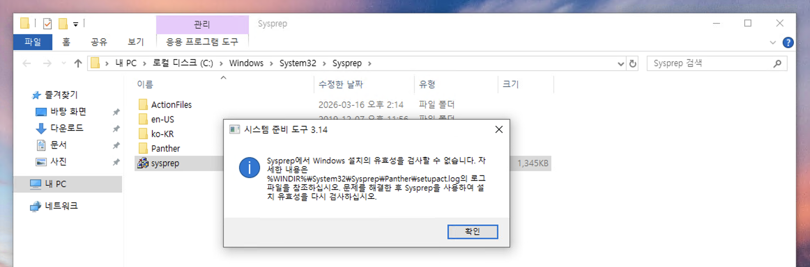
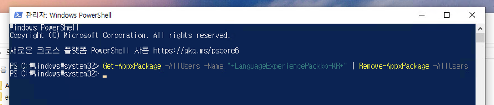
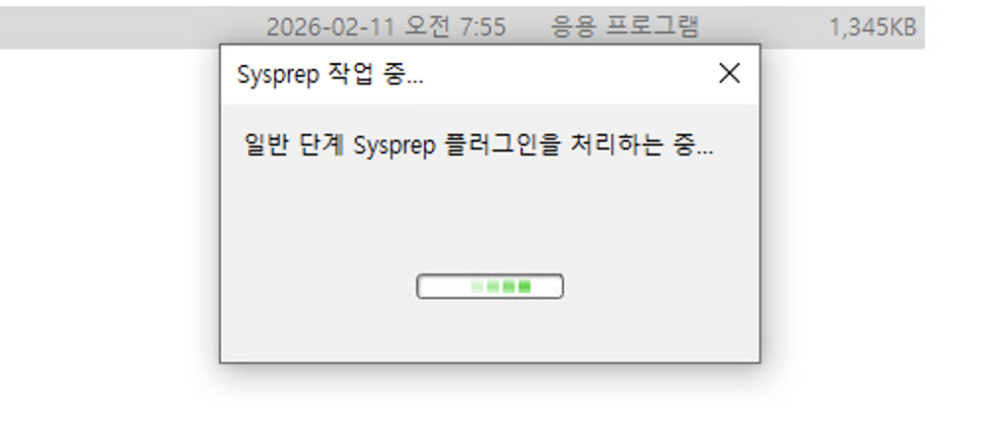

# Day 03 Troubleshooting: Windows 10 Sysprep 유효성 검사 오류

vCenter 템플릿 배포를 위한 Sysprep 실행 중 `Sysprep에서 Windows 설치의 유효성을 검사할 수 없습니다` 메시지와 함께 작업이 중단되는 문제

## 1. The Issue

* vCenter 전용 템플릿 제작을 위해 `sysprep.exe`를 실행

* 실행 직후 유효성 검사 실패 오류 팝업 발생 및 로그 확인 메시지 출력

    

* Windows 10 Virtual Machine은 Windows Update 및 VMware Tools만 설치된 순정 상태

## 2. Root Cause Analysis

* 실패 원인을 정확히 파악하기 위해 로그 파일([%WINDIR%\System32\Sysprep\Panther\setupact.log](./Logs/setupact.log))을 분석

    ```Plain text
    error SYSPRP Package Microsoft.LanguageExperiencePackko-KR_19041.80.275.0_neutral__8wekyb3d8bbwe was installed for a user, but not provisioned for all users.
    ```

* 특정 사용자에게만 설치되고 전체 사용자용으로 등록되지 않은 한국어 언어팩 패키지가 Sysprep의 일반화 과정을 방해함

* Windows 10/11은 기본 앱이나 언어팩 업데이트 시 특정 사용자 계정에만 귀속되는 경우가 있어 Sysprep 시 자주 충돌을 발생시킴

## 3. Resolution

* 관리자 권한으로 PowerShell을 실행한 후 아래 명령어를 입력하여 모든 사용자에 대해 해당 언어팩을 삭제

    ```powershell
    Get-AppxPackage -AllUsers -Name "*LanguageExperiencePackko-KR*" | Remove-AppxPackage -AllUsers
    ```

    

* Sysprep을 다시 실행하여 일반화 과정이 성공적으로 완료됨을 확인

    

## 4. Conclusion

* Windows Server 2022와 달리 Windows 10/11은 기본 설치된 스토어 앱들이 Sysprep을 방해하는 경우가 많음

* 템플릿 제작 시 가급적 네트워크를 차단한 상태에서 순정 이미지를 설치하거나, 설치 직후 불필요한 AppxPackage를 미리 정리하는 스크립트를 실행하는 것이 좋음

* 만약 다른 패키지 이름으로 에러가 난다면, 로그 파일에서 `error SYSPRP Package ... was installed for a user` 뒤에 나오는 패키지 명칭을 복사하여 위 명령어의 `-Name` 부분에 넣어 해결할 수 있음