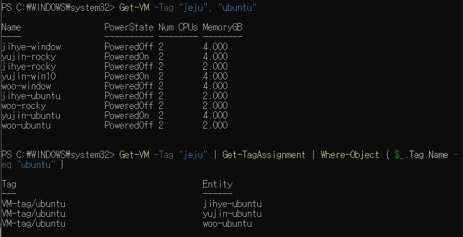
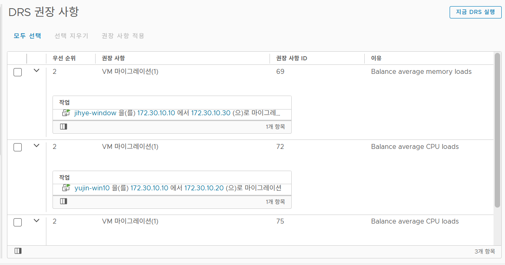

# 🧑🏻‍💻 Day 03 - Detailing Our Infrastructure - I

> **2026.03.11 수요일**

## 1. ESXi Account

**보안 강화 및 작업 추적:** 공용 root 계정 대신 개별 계정을 할당하여 접근을 통제

**설정 단계**

* **계정 생성:** `호스트` > `관리` > `보안 및 사용자` > `사용자 추가`

* **권한 부여:** `호스트` 우클릭 > `사용 권한` > 생성한 계정 추가 및 `관리자` 역할 할당

* **root 권한 회수:** `사용 권한` 목록에서 root 선택 > 역할을 `권한없음`으로 변경 후 저장

## 2. Lockdown Mode

ESXi 서버에 대한 직접 접속 (웹 UI, SSH 등)을 차단하여 vCenter를 통한 중앙 관리만 허용하는 보안 기능

### 2.1 모드별 차이점

* **정상 (Normal)**

    * DCUI (로컬 콘솔) 유지
    
    * vCenter 장애 시 예외 사용자 접속 가능

* **엄격 (Strict)**

    * DCUI (로컬 콘솔) 중지
    
    * vCenter 장애 시 접속 불가 (ESXi 재설치 필요)

### 2.2 목적

* **관리 지점 단일화:** 관리자가 개별 ESXi 호스트, DCUI, SSH에 직접 접속하여 설정을 변경하는 것을 차단하고, 오직 vCenter Server를 통해서만 관리하도록 강제

* **보안 우회 차단:** 호스트에 대한 직접 접근(Host Client 웹 UI, SSH 등)을 막아 보안 정책 및 권한 통제를 우회하는 행위를 방지

### 2.3 사용 방법

* `호스트`를 마우스 우클릭 > 잠금 모드를 선택 정상 잠금 or 엄격 잠금 선택

* **접근 권한 요약**

    | 모드 | 사용자 구분 | DCUI | SSH / Shell | Host Client | vCenter |
    | --- | --- | --- | --- | --- | --- |
    | 비활성 | 일반 / 예외 | O | O | O | O |
    | 노말 잠금 (Normal) | 일반 사용자 | X | X | X | O |
    |  | 예외 사용자 | O | O | O | O |
    | 엄격 잠금 (Strict) | 일반 사용자 | X | X | X | O |
    |  | 예외 사용자 | X (서비스 정지) | O | O | O |

## 3. VM Tag

객체를 논리적으로 그룹화하는 메타데이터 라벨.

### 3.1 목적

* 수많은 VM 중 특정 조건에 해당하는 대상만 즉시 필터링하여 찾아내기 위해 사용

* 특정 조건에 해당하는 VM에 일괄 정책을 구성할 수 있음

### 3.2 사용 방법

* **태그 범주 생성**

    * `태그 및 사용자 지정 특성` > `범주 (Categories)` > `새로 만들기`

* **태그 (Tag) 생성**

    * 동일 메뉴의 `태그 (Tags)` 탭 선택 >  `새로 만들기`

* **VM에 태그 할당**

    * `가상 시스템(VM)` 마우스 우클릭 > `태그 및 사용자 지정 특성` > `태그 할당(Assign Tag)`

    * 팝업된 창에서 생성해 둔 태그를 선택하고 `할당`을 클릭

### 3.3 검색 결과

* "jeju"와 "ubuntu" 태그에 해당하는 VM 필터링

    

## 4. VM Template

새로운 가상 머신(VM)을 대량으로 찍어내기 위해 사용하는 **읽기 전용 마스터 원본 이미지**

템플릿 상태에서는 전원을 켜거나 설정을 변경할 수 없음

### 4.1 목적

OS 설치, 기본 설정, 필수 소프트웨어 구성이 완료된 상태를 복제하므로 배포 시간을 단축하고 인프라 전체의 표준화 (일관성)를 유지하기 위해 사용

* **템플릿을 만들 때 OS 초기화 필수 이유**

    * **네트워크 충돌**

        * 원본 VM의 네트워크 설정이 그대로 복사
        
        * 복제된 VM들이 네트워크에 연결되는 순간 IP 충돌이 발생

    * **시스템 식별자 (ID) 충돌**

        * Windows의 SID나 Linux의 machine-id가 중복
        
        * 이로 인해 DHCP 서버가 동일한 머신으로 인식하여 같은 IP를 할당하는 오류 발생

### 4.2 OS 별 초기화

#### Windows에서 초기화

* Windows는 템플릿을 만들 때 내장된 시스템 준비 도구 (Sysprep)를 실행하여 고유 식별 정보를 자동으로 제거
    
* `sysprep.exe /oobe /generalize /shutdown` 실행

#### Linux에서 초기화

* Linux는 Sysprep 같은 단일 도구가 내장되어 있지 않으므로, 관리자가 직접 명령어를 입력하여 식별 정보와 캐시를 지워야 함

* **Ubuntu에서의 데이터 삭제**

    ```Bash
    # 1. 캐시 정리 및 cloud-init 초기화
    apt clean
    apt autoremove -y
    cloud-init clean

    # 2. SSH 호스트 키 삭제
    rm -f /etc/ssh/ssh_host_*

    # 3. 머신 ID (Machine-ID) 초기화
    truncate -s 0 /etc/machine-id
    rm -f /var/lib/dbus/machine-id
    ln -s /etc/machine-id /var/lib/dbus/machine-id

    # 4. 임시 파일 및 시스템 로그 삭제:
    rm -rf /tmp/* /var/tmp/* /var/log/**/*.gz

    # 5. 작업 히스토리 삭제 및 즉시 종료
    cat /dev/null > ~/.bash_history && history -c && poweroff
    ```

* **Rocky에서의 데이터 삭제**

    ```Bash
    # 1. 패키지 캐시 정리(Rocky에는 cloud-init 존재X)
    dnf clean all

    # 2. 네트워크 설정 초기화 (NetworkManager에 저장된 기존 IP/MAC 정보 삭제. 새 VM은 DHCP로 IP를 새로 받음)
    rm -f /etc/NetworkManager/system-connections/*

    # 3. SSH 호스트 키 삭제:
    rm -f /etc/ssh/ssh_host_*

    # 4. 머신 ID (Machine-ID) 초기화:
    truncate -s 0 /etc/machine-id

    # 5. 임시 파일 및 시스템 로그 삭제:
    rm -rf /tmp/* /var/tmp/* /var/log/**/*.gz

    # 6. 명령어 실행 히스토리 삭제 및 종료:
    cat /dev/null > ~/.bash_history && history -c && poweroff
    ```

### 4.3 사용자 지정 규격

템플릿에서 새 VM을 배포할 때 IP 주소, 컴퓨터 이름, 도메인 가입, 타임존 등의 OS 설정을 자동으로 변경해 주는 vCenter의 프로비저닝 기능으로, VMware Tools가 필수

* **미사용 시:** 원본과 100% 동일하게 복제되어 네트워크 충돌 발생.

* **설정:** `정책 및 프로파일` > `사용자 지정 규격 관리자` > 대상 OS 및 네트워크 정책 생성.

* **적용:** 템플릿 배포 마법사에서 [운영 체제 사용자 지정] 체크 후 생성해 둔 규격 선택.

### 4.4 OS를 초기화와 사용자 지정 규격을 둘 다 해야할까?

#### 둘 다 IP 충돌을 방지하기 위해 설정하는 것인데 둘 다 해야할까?

* **OS 초기화:** 기존 시스템의 흔적을 완전 삭제.

* **사용자 지정 규격:** 새 VM 부팅 시, 새로운 설정을 주입.

#### 단일 기능만 적용 시 발생하는 문제점

* **초기화만 적용 시** 

    * IP/MAC 충돌은 방지되나, 새 VM마다 일일이 수동으로 고정 IP와 호스트명을 입력해야 하므로 자동화 목적 상실.

* **사용자 지정 규격만 적용 시** 

    * **Windows:** vCenter가 부팅 단계에서 내부적으로 Sysprep을 강제 호출하므로 문제없음.

    * **Linux:** IP와 호스트명은 새것으로 변경되나, 원본의 SSH 호스트 키와 명령어 기록 등이 그대로 복제되어 보안 위협을 초래.

## 5. Content Library

VM 템플릿, ISO 이미지 등의 파일을 저장하고 관리하는 **중앙 집중식 컨테이너 (저장소)**

### 구성 및 연동 방법

* **게시자:** `콘텐츠 라이브러리` > `새로 만들기` > `로컬` 선택 > `외부에서 게시` 체크 후 URL복사.

* **구독자:** 다른 vCenter에서 라이브러리 생성 > `구독됨` 선택 > URL 붙여넣기 > 다운로드 정책 설정

* **사용:** 라이브러리 템플릿 우클릭 후 VM 배포 클릭 후 CD/DVD를 콘텐츠 라이브러리 ISO로 마운트.

## 6. Alarm

사전 장애 감지 및 이메일 발송 등의 자동 대응을 위한 모니터링 시스템.

### 6.1 알람의 핵심 구성 요소

* **대상:** 알람을 모니터링할 기준 객체 (CPU, 메모리 등)

* **트리거 규칙:** 알람을 발생시키는 조건

* **조건/상태 기반:** 리소스 사용량 측정

* **심각도:** 정상 (녹색), 경고 (노란색), 위험 (빨간색)

* **작업:** 조건이 충족되었을 때 시스템이 자동으로 수행할 동작.

### 6.2 알람 설정 방법

대상 객체 선택 > `구성` > `알람 정의` > 추가 > 모니터링 메트릭 및 임계값 지정.

* **만들어진 알람**

    

* **알람 실행:** `stress-ng`를 사용하여 CPU 부하를 주었을 때 알람 발생

    

## 7. DRS: Distributed Resource Scheduler

클러스터 내의 여러 ESXi 호스트 간에 컴퓨팅 리소스 사용량을 지속적으로 모니터링하고, VM을 최적의 호스트로 재배치하는 리소스 로드 밸런싱 기능.

* **사전 조건:** vCenter, 클러스터, 공유 스토리지, vMotion 네트워크 구성

* **자동화 수준**

    * **Manual:** 처음 배치부터 추후에 이동할 때에도 DRS 권장사항에서 사용자가 선택

    * **Partially Automated:** 처음 VM 전원을 켤 때에는 여유가 있는 호스트를 찾아 자동으로 배치. 하지만 운영 중에는 DRS 권장사항에서 사용자가 선택
    
    * **Fully Automated:** 초기 배치와 운영 중 로드 밸런싱 모두 시스템이 자동으로 배치.

### 7.1 DRS 사용

* 호스트 당 CPU 사용량

    
   
    * `172.03.10.10` 호스트의 사용량이 압도적으로 많음

* DRS 권장사항 (시각적으로 확인하기 위해 Manual로 설정)

    

    * CPU 사용량이 많은 호스트에서 다른 호스트로 옮기라고 권장함

* 만약 DRS 규칙을 어긴다면?

    

    * 사진과 같이 전원이 안 켜짐

### 7.2 Affinity Rules

VM들이 특정 ESXi 호스트에 배치되거나 마이그레이션되는 방식을 강제하는 논리적 제어 정책

* **Affinity:** 특정 VM들을 같은 호스트에 배치하는 것

* **Anti-Affinity:** 특정 VM들을 서로 다른 호스트에 분산 배치하는 것

* **Affinity 결과**

    

    * Rocky VM끼리 Affinity를 설정했을 때 사진과 같이 권장사항이 Rocky끼리 묶여서 뜸

## 8. Autostart, Shutdown

ESXi 호스트의 전원을 키거나 끌 때 VM의 시작/종료 순서를 제어

### 8.1 사용 목적

* **서비스 자동 복구:** ESXi 호스트가 재부팅되거나 전원이 켜질 때, VM을 지정된 순서대로 부팅.

* **안전한 서비스 종료:** ESXi 호스트 종료 시, 동작 중인 VM들을 강제 종료하지 않고 OS 내부에 정상 종료 신호를 보내 데이터 손상 및 파일 시스템 오류를 방지

* **부팅 의존성 제어:** DNS, DB 서버 등 인프라 핵심 서비스가 먼저 켜진 후, 이를 참조하는 WAS/WEB 서버가 켜지도록 부팅 순서와 지연 시간을 통제

### 8.2 설정 방법

* 호스트 선택 > `구성` > `VM 시작/종료` 편집 > 활성화 > VM을 자동 시작 섹션으로 이동 후 순서 및 지연 시간 지정