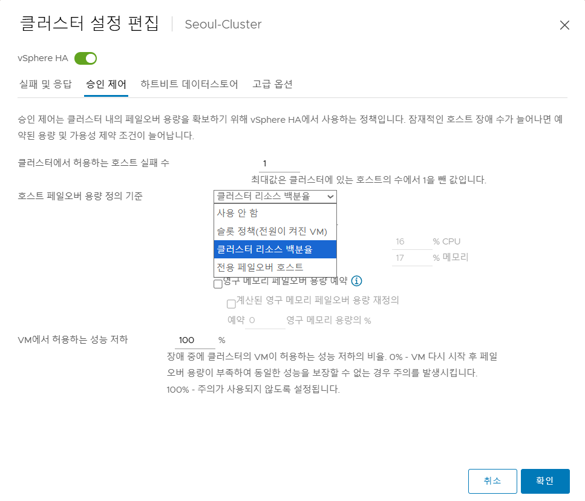
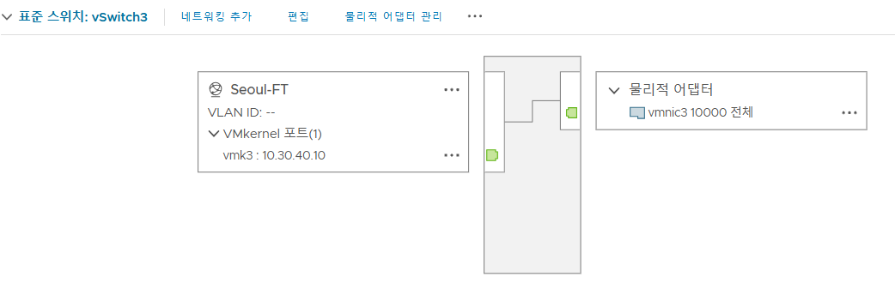
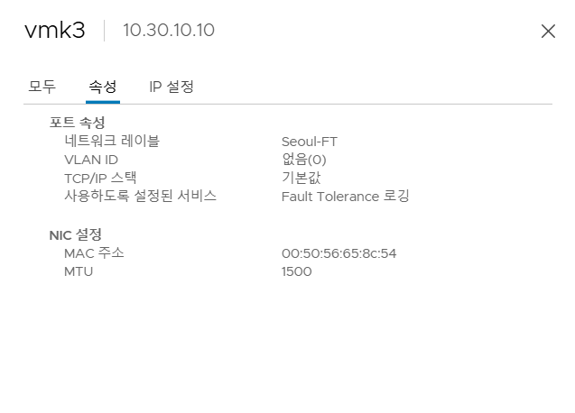
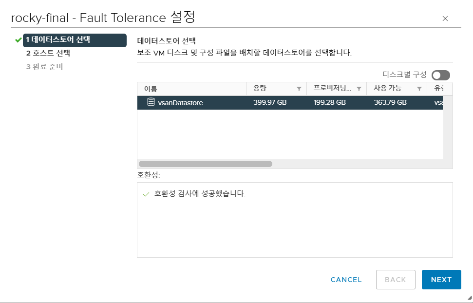
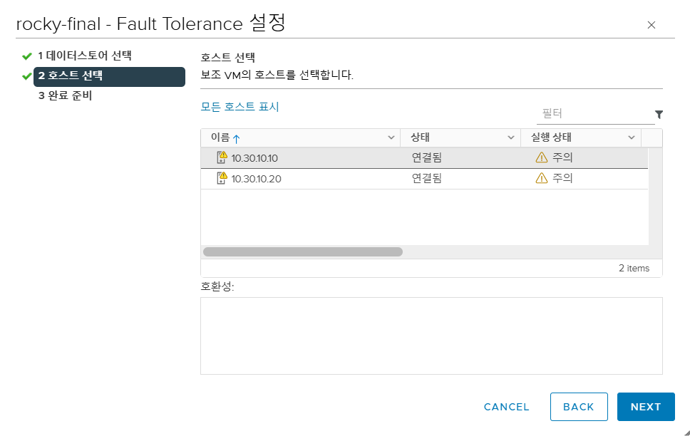

# 👩🏻‍💻 Day 04 - Detailing Our Infrastructure - II

> **2026.03.12 목요일**

## 1. Resource Pool

가상화 환경에서 **물리 자원 (CPU/Memory)을 논리적 단위로 분할**하여 각 팀이나 워크로드에 할당하는 메커니즘


* 클러스터 또는 호스트의 CPU와 메모리를 **논리적으로 나누어 관리**하는 기능

* 팀별, 업무별로 물리 자원을 얼마나 쓸지 정의하고, 우선순위 기반 경쟁 RP를 설정할 수 있음

   ```
   Cluster (DRS 활성화)
   └── Resource Pool A  (팀 A)
   │   ├── VM-1
   │   └── VM-2
   └── Resource Pool B  (팀 B)
      ├── Resource Pool B-1  (하위 업무)
      └── VM-3
   ```

### 1.1 Share (공유)

* 자원 경쟁 발생 시 **우선순위 비율**을 결정

* 형제(sibling) 리소스 풀 간 상대적으로 비교함

* **자원 경쟁이 발생할 때만** 적용

* 여유 자원이 충분하면 모두 요청한 만큼 사용

* 우선 순위 레벨과 상대 비율

   | 레벨 | 상대 비율 | 설명 |
   | --- | --- | --- |
   | `Low` | 1 | 낮은 우선순위 |
   | `Normal` | 2 | 기본값 |
   | `High` | 4 | 높은 우선순위 |

### 1.2 Reservation (예약)
 
해당 리소스 풀에 **최소 보장되는 자원량**

* 설정한 예약량은 다른 풀이 사용할 수 없도록 확보

* 자식 풀의 예약 합계는 부모 풀의 예약량을 초과할 수 없음 (`Expandable Reservation` 비활성화 시)

### 1.3 Limit (제한)
 
해당 리소스 풀이 **최대로 사용할 수 있는 자원량**

### 1.4 Expandable Reservation
 
자식 풀이 자신의 예약량만으로 **부족할 때, 부모 풀의 남는 예약 자원을 빌려오는 옵션**

* Seoul-DC 데이터센터 내 Seoul-Cluster에 2개의 Resource Pool(Seoul-RP-01, Seoul-RP-02)을 구성

   

* Seoul-RP-01 리소스 풀의 모니터링 화면

   

## 2. HA: High Availability

호스트 또는 VM 장애 발생 시 **다른 호스트에서 VM을 자동으로 재시작**하여 서비스 가용성을 유지하는 클러스터 기능

무중단 (Zero Downtime)이 아닌, **장애 후 자동 재시작 (Auto Restart)**

### 2.1 전제 조건

HA는 **클러스터 단위 기능**이므로, 개별 호스트에 적용할 수 없음.

ESXi 호스트를 클러스터에 먼저 추가한 뒤, Cluster → Configure → vSphere Availability → Edit에서 HA를 활성화

### 2.2 HA Admission Control

장애 발생 시 VM을 다시 실행할 수 있도록 **클러스터 자원을 미리 예약**하는 정책

"호스트 하나가 죽었을 때 남은 호스트에서 VM을 되살릴 자리가 있느냐"

### 2.3 정책 유형 비교



| 정책 | 설명 | 특징 |
| --- | --- | --- |
| **Host** | 몇 개의 호스트 장애를 견딜지 지정 | 직관적, 대부분의 환경에 권장 |
| **Percent** | 클러스터 CPU/Memory의 일정 %를 예약 | 자원 비율 기준 |
| **Slot** | VM 1개가 쓰는 CPU + Memory = 1 Slot으로 계산 | 가장 보수적인 방식 |

### 2.4 클러스터 설정 항목


* **호스트 모니터링 (Host Monitoring)**

   ESXi 호스트들이 서로 살아있는지 **지속적으로 감시**하는 기능. HA의 가장 기본 전제 조건으로, 이것이 꺼져 있으면 나머지 HA 기능이 동작하지 않음.

* **호스트 실패 응답 (Host Failure Response)**

   호스트 자체가 **완전히 죽었을 때** 어떻게 반응할지. VM 다시 시작: 장애 호스트의 VM을 살아있는 다른 호스트에서 재시작

* **호스트 분리 응답 (Host Isolation Response)**

   호스트가 완전히 꺼진 것이 아니라, **관리 네트워크에서 고립(Isolated)된 상태**일 때의 반응

   | 옵션 | 동작 |
   |------|------|
   | 사용 안 함 | 영향받은 VM에 아무 작업도 수행하지 않음 |
   | 전원을 끈 후 VM 다시 시작 | VM 강제 종료 후, 온라인 호스트에서 재시작 |
   | 종료 후 VM 다시 시작 | VM 정상 종료(Graceful) 후, 온라인 호스트에서 재시작 |

   > **Note**  
   > "종료 후 VM 다시 시작"이 데이터 안전성 측면에서 권장되지만, VMware Tools가 설치되어 있어야 정상 작동

* **PDL 데이터스토어 응답**

   **PDL (Permanent Device Loss)** — 스토리지가 **영구적으로 사라진** 것이 확실한 상태

   | 옵션 | 동작 |
   |------|------|
   | 사용 안 함 | 아무 작업도 수행하지 않음 |
   | VM 전원 끄기 후 다시 시작 | 영향받은 VM을 강제 종료 후 다른 호스트에서 재시작 |

* **APD 데이터스토어 응답**

   **APD (All Paths Down)** — 스토리지로 가는 모든 경로가 끊겼으나, **일시적인지 영구적인지 불명확**한 상태

   * PDL → 영구 손실 확정  → 즉각 조치 가능
   
   * APD → 일시/영구 불명  → 대기 후 판단 (더 애매한 상태)

* **VM 모니터링 (VM Monitoring)**

   호스트가 살아있어도 **VM 내부가 멈췄을 때** 감지하여 재시작하는 기능. VMware Tools의 heartbeat를 기준으로 판단

   | 설정 | 대상 |
   |------|------|
   | VM 모니터링만 | VM heartbeat 기준 |
   | VM 및 애플리케이션 모니터링 | VM + 앱 레벨 heartbeat 기준 |

* **Heartbeat Datastores**

   관리 네트워크가 끊겼을 때, HA가 이를 **진짜 호스트 장애로 오판하지 않도록** 보조 판단 수단으로 사용하는 장치

   * 판단 흐름
      
      * 관리 네트워크 끊김 감지
      
      * Datastore Heartbeat 확인
         
         * 정상 → Network Partition (고립) → 분리 응답 정책 적용
         
         
         * 비정상 → Host Failure 판단 → VM 재시작
   * HA는 자동으로 접근 가능한 Datastore 중 heartbeat용 DS 선택
   
   * 가능하면 **2개 이상의 Heartbeat Datastore** 지정 권장

## 3. HA 실습

### 3.1 클러스터 생성

vCenter → Datacenter → New Cluster

   * 이미 Jeju / Seoul 클러스터가 있다면 skip

### 3.2 vSphere HA 활성화

Cluster → Configure → vSphere Availability → Edit → HA ON


### 3.3 Host Monitoring 켜기

HA 동작의 기본 전제 — 반드시 활성화

### 3.4 Admission Control 설정

Host / Percent / Slot 중 환경에 맞는 정책 선택

### 3.5 VM Monitoring 설정 (선택)

호스트 장애 외 VM 자체 장애도 감지할 경우 활성화

### 3.6 Heartbeat Datastore 확인

Configure → vSphere Availability → Heartbeat Datastores에서 2개 이상 지정 권장

### 3.7 장애 테스트

특정 호스트에 VM 올려두기

   * 해당 호스트를 강제 장애 상태로 만들기
   
   * 다른 호스트에서 VM이 자동 재시작되는지 확인

## 4. FT: Fault Tolerance

하나의 VM을 두 ESXi 호스트에서 **동시에 실행**하여, 호스트 장애가 발생해도 **서비스 중단 없이** 즉시 이어받는 기능

### 4.1 HA vs FT 비교
 
| | **HA** | **FT** |
| --- | --- | --- |
| 방식 | 장애 발생 후 다른 호스트에서 **재시작** | 처음부터 다른 호스트에서 **동시 실행** |
| 다운타임 | 있음 (재시작 시간) | **없음** |
| 데이터 손실 | 일부 가능 | **없음** |
| 연속성 | 자동 복구 | 무중단 연속성 |
| 자원 소비 | 낮음 | 높음 (VM 2배) |

### 4.2 요구사항

* ESXi 호스트 **2개 이상**의 클러스터 환경

* **Shared Storage** (Primary / Secondary VM이 동일 데이터스토어 접근)

* **FT 전용 네트워크** (별도 커널 + 스위치 구성)

* FT 지원 범위 안의 VM (requirements, limits, licensing 사전 확인 필요)

## 5. FT 실습
 
### 5.1 클러스터 준비

FT는 Secondary VM을 **다른 호스트**에 생성해야 하므로, 최소 2개 이상의 ESXi 호스트가 있는 클러스터 환경이 필요

### 5.2 테스트용 VM 준비

실습용으로 가벼운 VM 준비
 
### 5.3 FT 전용 네트워크 구성

FT 트래픽은 다른 네트워크와 **분리된 전용 네트워크**에서 통신하며, 중단되면 안 되는 동기화 트래픽이기 때문에 독립적으로 구성

**구성 항목:**

1. FT용 VMkernel 어댑터 생성
2. 전용 vSwitch 생성
3. VLAN ID: 40 으로 설정
4. FT Logging 트래픽 유형 체크


*FT 전용 네트워크 구성*


*FT Logging 트래픽 유형 체크*

### 5.4 FT 활성화





* VM 우클릭 → Fault Tolerance → Turn On Fault Tolerance → Yes → Secondary VM이 올라갈 Datastore 선택 → Secondary VM이 올라갈 Host 선택 → 완료

### 5.5 Secondary VM 생성 확인
 
설정 완료 후 **다른 호스트에 Secondary VM**이 생성되고, Primary와 실시간 동기화 상태를 유지

* Secondary VM이 항상 다른 호스트에 **Standby 상태로 존재**

* 장애가 발생하는 순간 전환이 이루어지므로 별도의 부팅 과정이 없음.
 
### 5.6 장애 상황 테스트
 
Primary가 있던 호스트에 장애를 발생시켜 Secondary가 이어받는 흐름 확인

```
[정상 상태]
  Host-1: Primary VM   🟢 ──── lockstep ────  Host-2: Secondary VM 🟡
 
[Host-1 장애 발생]
  Host-1: ❌
                                               Host-2: Secondary → Primary 🟢
                                               (중단 없이 즉시 이어받음)
 
[복구 후]
  Host-1 복구 → 새 Secondary VM 자동 생성 → 동기화 재개
```

<!-- 위의 코드 블록의 의도를 모르겠어요....ㅜ -->

## 6. vApp

* 여러 개의 VM을 **하나의 애플리케이션 단위**로 묶어서 관리하는 VMware 기능

* **VM 그룹 + 관리 정책**을 하나의 패키지처럼 다룸

* 개별 VM을 따로 관리하는 것이 아니라, 관련된 VM들을 **하나의 vApp으로 묶어** 일괄 제어

* vApp 단위로 **전원 켜기 / 끄기 / 복제 / 내보내기** 가능

### 6.1 VM 시작 순서 (Start Order)

VM 간 **의존성**이 있을 경우, 켜지는 순서를 지정할 수 있음

| 설정 항목 | 설명 |
|-----------|------|
| Start Order | VM 기동 우선순위 (숫자가 낮을수록 먼저 켜짐) |
| Start Delay | 다음 VM 켜기 전 대기 시간 (초) |
| Stop Order | 종료 순서 (시작의 역순이 일반적) |

### 6.2 자원 관리

vApp은 내부적으로 **Resource Pool처럼 동작**

CPU / Memory의 Share, Reservation, Limit을 vApp 단위로 설정 가능

### 6.3 패키지 관리 (OVF / OVA 내보내기·가져오기)

vApp은 **OVF(Open Virtualization Format)** 또는 **OVA** 형식으로 내보낼 수 있어,  
애플리케이션 전체를 **하나의 패키지**처럼 이식하거나 배포 가능