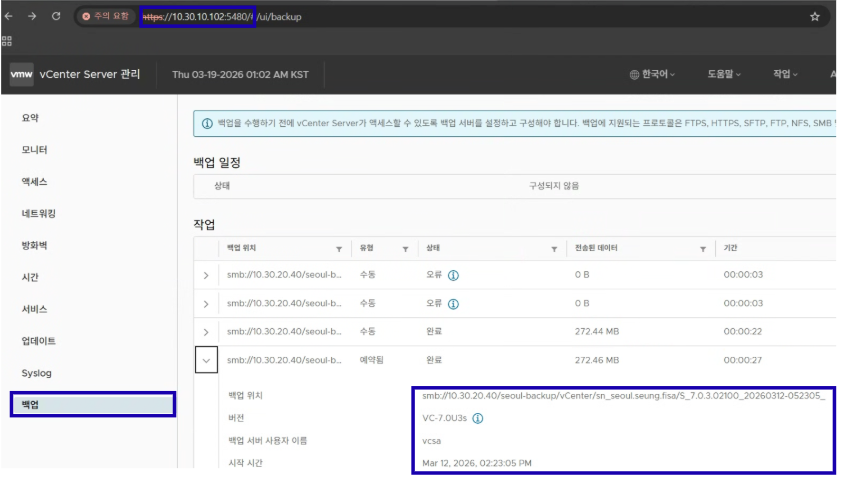
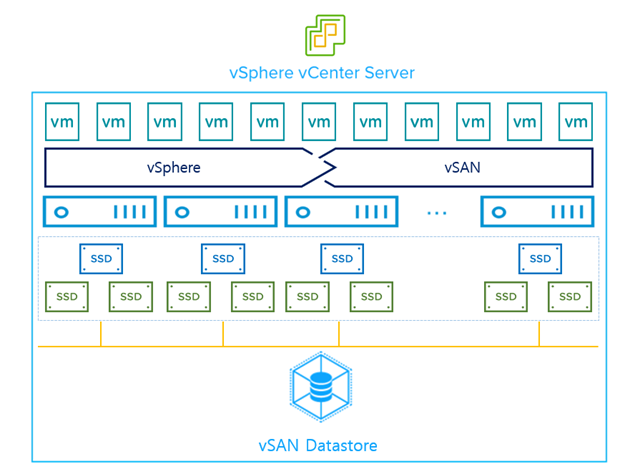
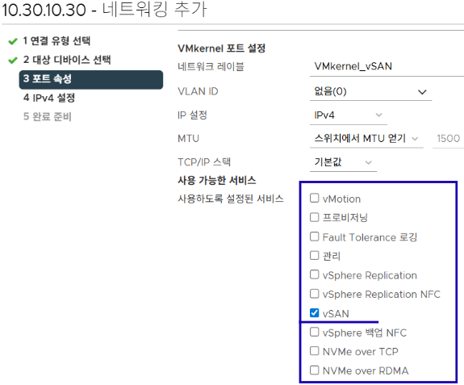
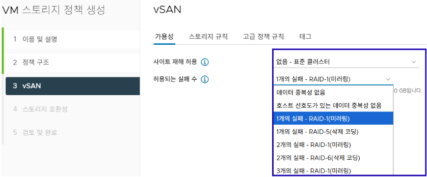

# 👩🏻‍💻 Day 05 - vSAN and VM Provisioning Portal

> **2026.03.13 금요일**

## 0. Day 05 핵심 목표

Day 05에서는 기존 vSphere 환경에 **vSAN**으로 구성하고, **vCenter API**를 활용해 웹 화면을 통한 VM 생성 및 접속 기능을 구현합니다. 

## 1. vCenter Backup

### 1.1 목적

* 장애 및 오류 상황에 기존 설정과 상태를 복구하기 위해 사용

* vCenter 재구축 가능

### 1.2 사용방법

* vCenter Server Appliance 관리 페이지를 `https://10.30.10.102(vcenter-ip):5480` 주소를 통해 접속

* 백업 진행 시 **백업 위치**를 지정해야 하며, **스케줄 설정**을 통해 원하는 시간에 자동 백업 가능

  * 백업 위치 예: `smb://10.30.20.40/seoul-backup/vCenter/sn_seoul.seung.fisa`

* 백업 내용을 vCenter 설치 시 지정해서 시작 가능

## 2. About vSAN

여러 ESXi 호스트의 저장장치를 하나의 Shared Storage 처럼 묶어서 사용하는 **VMware의 SDS 솔루션**

### 2.1 목적

* Storage를 **소프트웨어로 정의**하며 **논리적**으로 통합 가능

* **Scale-Out** 기반의 확장 가능

* **정책 기반** 관리 가능

### 2.2 필수 조건

* **ESXi 3대 이상**

  * **FTT**를 보장을 위해 원본과 복제본 그리고 Witness로 최소 3대가 필요

    | FTT | RAID와 복제방식 | 최소 노드 수 |
    | --- | --- | --- |
    | 1 | RAID-1 미러링(복제2+Witness) | 3 |
    | 1 | RAID-5 패리티 기반 | 4 |
    | 2 | RAID-6 더블 패리티 기반 | 6 |

* **네트워크 구성**

  * vSAN의 데이터 복제, **RAID 동기화** 등을 위해 호스트 간의 **VMKernel 네트워크 구성**이 필수

* **SSD의 필요**

  * vSAN은 **캐시 계층이 필수** 구조로, SSD가 쓰기 버퍼 및 읽기 캐시 역할을 수행

* **Disk Group 구조**  

  * 1 Disk Group = **Cache Tier (SSD 1개) + Capacity Tier (최대 7개 디스크)**

  * **Cache Tier**: SSD 1개 | `쓰기와 읽기 역할`

  * **Capacity Tier**: SSD or HDD 최소 1개 ~ 최대 7개 | `실제 데이터 저장`

## 3. vSAN Infrastructure

### 3.1 클러스터 생성

DataCenter에서 **클러스터**를 생성 시 `vSAN` 설정하여 생성

vSAN의 **Configuration**에서 `vSAN Service`를 활성화

* 클러스터 생성 시 `DRS`, `HA` 기능은 필요 시 활성화

### 3.2 VMKernel(vSAN) 추가

vSAN을 위한 **VMkernel 네트워크**를 vSwitch에 추가

### 3.3 Disk group 구성

클러스터의 Configuration에서 `디스크 관리` 부분에서 `디스크 그룹 생성`을 통해 생성

### 3.4 VM 스토리지 정책 추가

`메뉴`의 `정책 및 프로파일`에서 정책을 생성

* 알맞은 **FTT**와 **RAID** 을 통한 **정책**을 생성

  